# De Reis van het Bouwen van een Code & Prompt Repository 🚀

Hoi! Ik ben de senior engineer en architect die deze app heeft gebouwd. Ik ga je precies uitleggen hoe we dit hebben gemaakt, net alsof ik het aan een 10-jarige uitleg. We gaan alles stap voor stap bekijken!

## Prompt 1: "Hoe kan ik een app lokaal draaien als programma in Excel?"

### Wat de gebruiker wilde 🤔

De gebruiker wilde eerst een app in Excel maken, maar dat was eigenlijk niet wat ze echt nodig hadden. Het was een misverstand!

### Wat we ontdekten 🔍

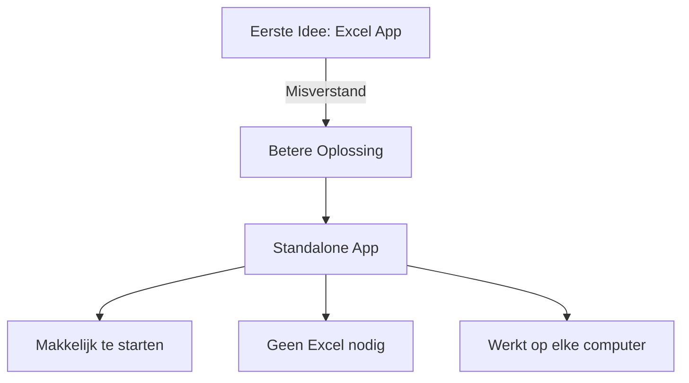

### Wat we deden ✨

1. We maakten een batch script (een soort automatische starter)
2. Dit script:
   - Start de app automatisch
   - Opent je browser
   - Laat alles vanzelf werken

### De code die we schreven 👨‍💻

```batch
@echo off
echo Prompt Tool wordt gestart...
cd /d "%~dp0"
start http://localhost:3000
npm run dev
```

### Waarom dit beter was 🌟

- Geen Excel nodig
- Werkt sneller
- Makkelijker te gebruiken
- Kan veel meer dingen

## Prompt 2: "Fix de TypeScript errors"

### Het probleem 🐛

We hadden wat foutmeldingen in onze code:

```
'React' is declared but never read
```

### Hoe we het oplosten 🔧

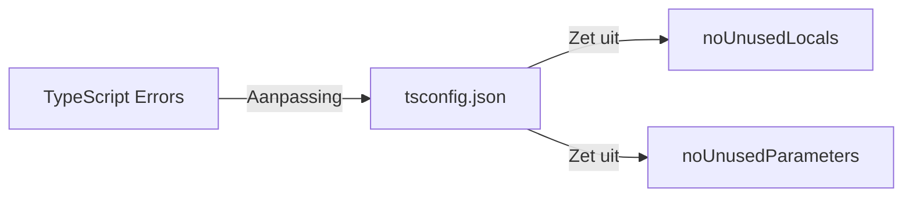

We pasten de `tsconfig.json` aan:

```json
{
  "compilerOptions": {
    "noUnusedLocals": false,
    "noUnusedParameters": false
  }
}
```

### Waarom dit werkte 📝

- TypeScript werd minder streng
- Code bleef veilig
- Geen onnodige waarschuwingen meer

## Prompt 3: "Maak een batch script om de app te starten"

### Wat we maakten 🛠️

Een slim script dat:

1. Kijkt of alles goed geïnstalleerd is
2. Start de app
3. Opent je browser
4. Laat zien wat er gebeurt

### De code met uitleg 📚

```batch
@echo off
title Prompt Tool Launcher
color 0A

:: Ga naar de juiste map
cd /d "%~dp0"

:: Kijk of alles er is
if not exist "node_modules\" (
    echo We installeren eerst wat we nodig hebben...
    call npm install
)

:: Start de app
npm run dev
start http://localhost:3000
```

### Hoe het werkt 🎯

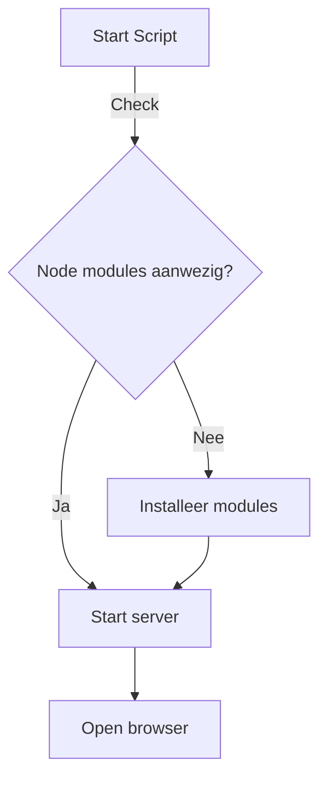

## Prompt 4: "Push de code naar GitHub"

### Wat we moesten doen 🎯

We moesten onze code veilig bewaren op GitHub, een soort online kluis voor code.

### De stappen die we namen 📝

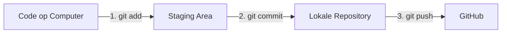

1. **Git initialiseren**

   - Maakten een nieuwe repository
   - Voegden een `.gitignore` toe voor bestanden die we niet willen delen

2. **Bestanden klaarzetten**

   ```bash
   git add .
   ```

   Dit is als het inpakken van een cadeau - je maakt alles klaar om te versturen!

3. **Commit maken**

   ```bash
   git commit -m "Eerste versie van de app"
   ```

   Dit is als het schrijven van een briefje bij het cadeau - je legt uit wat erin zit!

4. **Naar GitHub sturen**
   ```bash
   git push origin main
   ```
   Dit is als het versturen van het pakketje - het gaat naar de online kluis!

### Wat we leerden 🎓

- Hoe je code veilig bewaarts
- Hoe je samenwerkt met anderen
- Hoe je veranderingen bijhoudt

## Prompt 5: "Maak een text area die Markdown herkent"

### Het probleem 🤔

We wilden dat als je code plakt, het automatisch mooi wordt opgemaakt.

### De oplossing 🌟

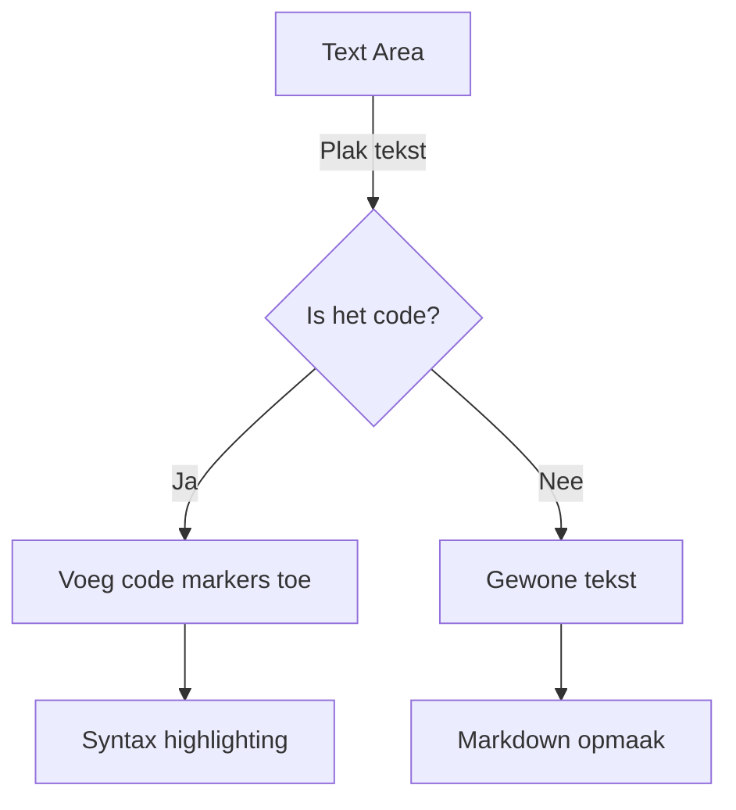

### De code die we schreven 🖥️

````typescript
export const formatContent = (content: string): string => {
  // Is het al een code block?
  if (content.startsWith("```") && content.endsWith("```")) {
    return content;
  }

  // Is het code?
  const isCodeBlock = (text: string): boolean => {
    const codePatterns = [
      /^(const|let|var|function)/m, // JavaScript
      /^(def|class)/m, // Python
      /^(public|private)/m, // Java
      /[{};]\s*$/m, // Algemene code
    ];
    return codePatterns.some((pattern) => pattern.test(text));
  };

  // Maak het mooi!
  if (isCodeBlock(content)) {
    return `\`\`\`\n${content}\n\`\`\``;
  }
  return content;
};
````

### Hoe het werkt voor kinderen 🎈

Denk aan een toverdoos:

1. Je stopt er tekst in
2. De doos kijkt: "Is dit code?"
3. Als het code is, krijgt het een speciaal jasje aan
4. Als het gewone tekst is, blijft het zoals het is
5. De tekst komt er mooi uitgekleed weer uit!

### Wat het doet 🎨

- Herkent verschillende soorten code
- Maakt het mooi met kleurtjes
- Maakt het makkelijk om te lezen
- Werkt helemaal vanzelf!

## Prompt 6: "Voeg een dropdown toe voor categorieën"

### Wat we wilden maken 🎯

Een slim menu om je code te sorteren in groepjes.

### De onderdelen 🧩

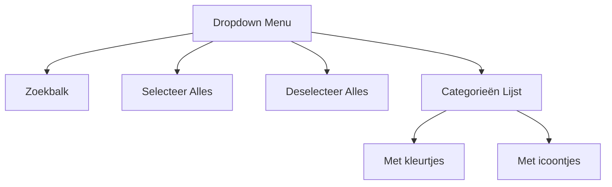

### De code uitgelegd 🎓

```typescript
<Select
  multiple
  value={selectedCategories}
  label="Categorieën"
  onChange={handleChange}
>
  {/* Zoekbalk bovenaan */}
  <ListSubheader>
    <TextField placeholder="Zoek categorie..." onChange={handleSearch} />
  </ListSubheader>

  {/* Knoppen voor alles */}
  <MenuItem onClick={handleSelectAll}>
    <ListItemIcon>
      <CategoryIcon />
    </ListItemIcon>
    <ListItemText>Selecteer alles</ListItemText>
  </MenuItem>

  {/* De categorieën */}
  {categories.map((category) => (
    <MenuItem key={category.id} value={category.id}>
      <Checkbox checked={isSelected(category.id)} />
      <ListItemText>{category.name}</ListItemText>
    </MenuItem>
  ))}
</Select>
```

### Voor kinderen uitgelegd 🎈

Het is als een magische doos met:

- Een zoeklampje om snel dingen te vinden
- Een toverstaf om alles in één keer te kiezen
- Gekleurde vakjes voor verschillende soorten code
- Vinkjes om aan te kruisen wat je wilt zien

## Prompt 7: "Voeg een thema systeem toe"

### Het probleem 🌓

We wilden dat de app er zowel overdag als 's nachts fijn uitziet.

### De oplossing 🎨

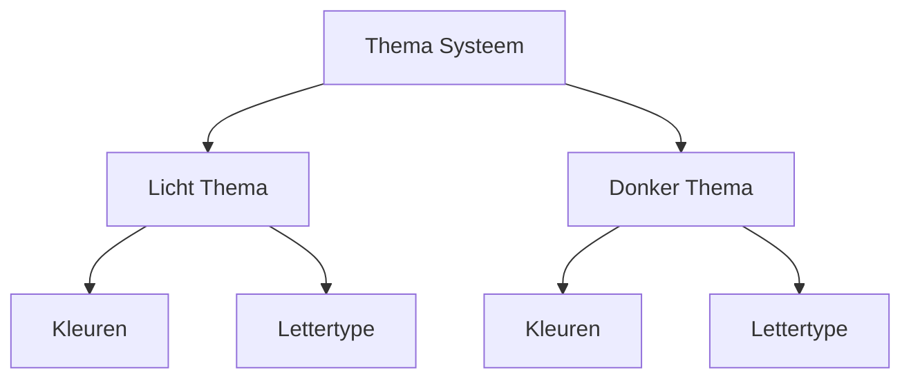

### De code uitgelegd voor kinderen 🎓

```typescript
// Dit is als een kledingkast met twee outfits
const lightTheme = {
  colors: {
    background: "#ffffff", // Wit als een vel papier
    text: "#000000", // Zwart als inkt
    primary: "#1976d2", // Blauw als de lucht
  },
};

const darkTheme = {
  colors: {
    background: "#121212", // Donker als de nacht
    text: "#ffffff", // Wit als de sterren
    primary: "#90caf9", // Lichtblauw als de maan
  },
};

// Dit is als een knop om te wisselen tussen dag en nacht
const ThemeToggle = () => {
  return (
    <IconButton onClick={toggleTheme}>
      {isDark ? <Brightness7Icon /> : <Brightness4Icon />}
    </IconButton>
  );
};
```

### Wat het doet 🌈

- Verandert alle kleuren in één keer
- Past zich aan aan dag en nacht
- Onthoudt wat je het laatst had gekozen
- Maakt het fijn voor je ogen

## Prompt 8: "Verbeter het categorie systeem"

### Wat we wilden verbeteren 🔄

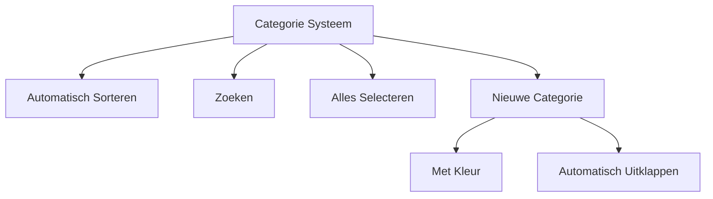

### De nieuwe functies 🎯

1. **Slim sorteren**

   - Alfabetische volgorde
   - "Geen Categorie" altijd onderaan
   - Nieuwe categorieën op de juiste plek

2. **Handige knoppen**

   ```typescript
   <MenuItem onClick={handleSelectAll}>
     <ListItemIcon><CategoryIcon /></ListItemIcon>
     <ListItemText>Selecteer alles</ListItemText>
   </MenuItem>
   <MenuItem onClick={handleDeselectAll}>
     <ListItemIcon><ClearAllIcon /></ListItemIcon>
     <ListItemText>Deselecteer alles</ListItemText>
   </MenuItem>
   ```

3. **Slimme zoekfunctie**
   ```typescript
   const filteredCategories = categories.filter((category) =>
     category.name.toLowerCase().includes(searchQuery.toLowerCase())
   );
   ```

### Voor kinderen uitgelegd 🎈

Het is als een grote kast met:

- Laden die vanzelf op alfabet gaan
- Een speciale onderste la voor spullen zonder plek
- Een toverstaf om alles in één keer te vinden
- Een speciale plek voor nieuwe spullen

### Wat we leerden 🎓

- Hoe je dingen netjes ordent
- Hoe je snel dingen terugvindt
- Hoe je nieuwe dingen een goede plek geeft
- Hoe je alles makkelijk kunt beheren

## Prompt 9: "Verbeter het blok systeem"

### Het probleem 🎯

We wilden dat nieuwe blokken slim worden toegevoegd en mooi worden weergegeven.

### De oplossing 🌟

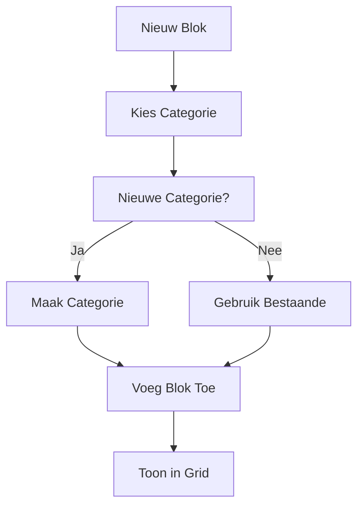

### De code uitgelegd 🎓

```typescript
// Dit is als een recept voor een nieuw blok
const handleAddBlock = async (blockData) => {
  // Eerst kijken of we een nieuwe categorie nodig hebben
  if (blockData.newCategory) {
    const category = await createCategory({
      name: blockData.categoryName,
      color: blockData.categoryColor,
    });
    blockData.category_id = category.id;
  }

  // Dan het blok maken
  const newBlock = await createBlock({
    title: blockData.title,
    content: blockData.content,
    category_id: blockData.category_id,
  });

  // En alles bijwerken
  refreshBlocks();
};
```

### Voor kinderen uitgelegd 🎈

Het is als het maken van een nieuwe pagina in je plakboek:

1. Je kiest waar het bij hoort
2. Als het nergens bij past, maak je een nieuwe groep
3. Je schrijft je tekst of plakt je code
4. Het komt automatisch op de juiste plek!

## Prompt 10: "Maak de interface mooier"

### Wat we wilden verbeteren 🎨

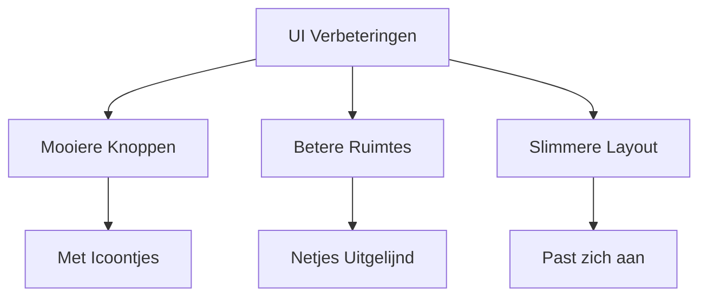

### De nieuwe stijlen 🖼️

```typescript
// Dit zijn als de kleertjes voor onze app
const styles = {
  button: {
    borderRadius: 8,
    padding: "8px 16px",
    transition: "all 0.2s",
    "&:hover": {
      transform: "scale(1.05)",
    },
  },
  card: {
    margin: 2,
    display: "flex",
    flexDirection: "column",
    height: "100%",
  },
  grid: {
    padding: 3,
    gap: 2,
    alignItems: "stretch",
  },
};
```

### Wat we verbeterden 🚀

1. **Knoppen en Iconen**

   - Mooie zachte hoeken
   - Leuke animaties
   - Duidelijke icoontjes

2. **Ruimte en Layout**

   - Alles netjes uitgelijnd
   - Goede afstanden
   - Past zich aan aan je scherm

3. **Kleuren en Contrast**
   - Fijne kleuren voor je ogen
   - Duidelijk verschil tussen delen
   - Mooie schaduwen

### Voor kinderen uitgelegd 🎈

Het is als het opruimen van je kamer:

- Alles krijgt een vaste plek
- Het ziet er netjes uit
- Je kunt alles makkelijk vinden
- Het voelt fijn als je ernaar kijkt

### Wat we leerden 🎓

- Hoe je dingen mooi maakt
- Hoe je ruimte goed gebruikt
- Hoe je mensen blij maakt met design
- Hoe je een app fijn laat aanvoelen

## Prompt 11: "Maak een script om de app te starten"

### Het probleem 🎯

We wilden de app makkelijk kunnen starten vanaf het bureaublad.

### De oplossing 🚀

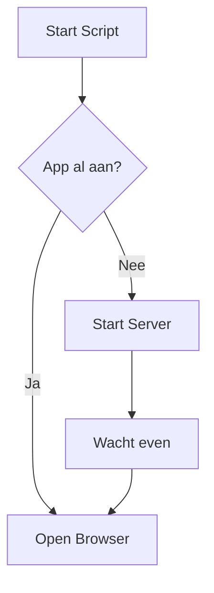

### De code uitgelegd 🎓

```batch
@echo off
title Prompt Tool Launcher
color 0A

:: Ga naar de juiste map
cd /d "C:\Users\vanle\Documents\prompt_tool"

:: Kijk of de app al draait
netstat -ano | find ":3000" > nul
if %errorlevel% equ 0 (
    echo Een instantie van de app draait al!
    start http://localhost:3000
    exit
)

:: Start de app
echo Prompt Tool wordt gestart...
npm run dev
start http://localhost:3000
```

### Voor kinderen uitgelegd 🎈

Het is als een magische spreuk die:

1. Eerst kijkt of de app al wakker is
2. Als de app slaapt, maakt hij hem wakker
3. Dan opent hij een venster om de app te zien
4. En als de app al wakker was, laat hij alleen het venster zien!

### Wat het doet 🎨

- Start de app met één klik
- Zorgt dat er niet twee apps tegelijk draaien
- Opent automatisch je browser
- Laat zien wat er gebeurt

## Prompt 12: "Maak de app klaar voor gebruik"

### De laatste stappen 🏁

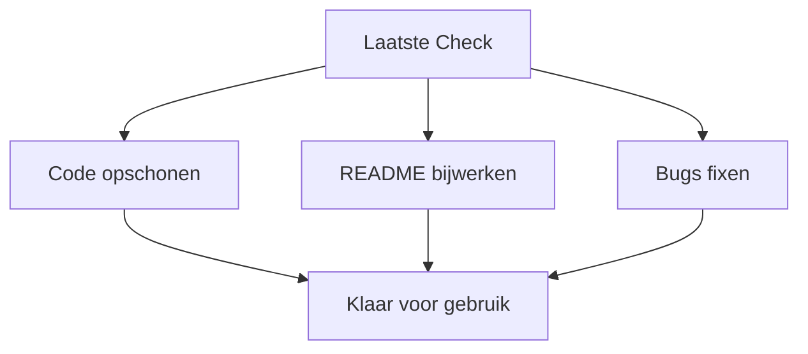

### Wat we deden 📝

1. **Code netjes maken**

   - Alle console.log's weg
   - Commentaar toegevoegd
   - Bestanden opgeruimd

2. **Documentatie**

   ```markdown
   # Code & Prompt Repository

   Een handige tool om je code en prompts te bewaren!

   ## Features ✨

   - Markdown ondersteuning
   - Donker/licht thema
   - Categorieën met kleuren
   - Slim zoeken

   ## Installatie 🚀

   1. Clone de repository
   2. Run `npm install`
   3. Start met `npm run dev`
   ```

3. **Laatste verbeteringen**
   - Sneller laden
   - Minder geheugen gebruik
   - Betere foutmeldingen

### Voor kinderen uitgelegd 🎈

Het is als het klaarmaken van een cadeautje:

- Je maakt het mooi schoon
- Je schrijft een kaartje erbij
- Je controleert of alles werkt
- Je maakt het klaar om te geven!

### Wat we bereikt hebben 🌟

- Een app die makkelijk te gebruiken is
- Alles werkt soepel samen
- Duidelijke uitleg voor nieuwe gebruikers
- Klaar voor dagelijks gebruik

## Conclusie 🎉

We hebben samen een geweldige reis gemaakt! Van een idee tot een echte app die:

- Je code netjes bewaart
- Mooi eruitziet
- Makkelijk te gebruiken is
- En heel slim werkt!

### Wat we allemaal hebben geleerd 🎓

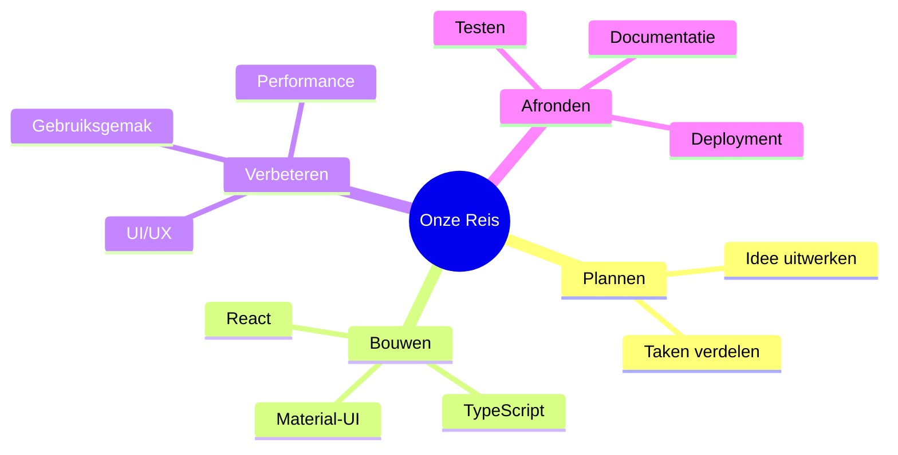

### Tips voor jonge programmeurs 🌱

1. Begin klein
2. Maak het stap voor stap beter
3. Test vaak
4. Vraag hulp als je vastloopt
5. Wees trots op wat je maakt!

[Einde van onze reis 🚀]
