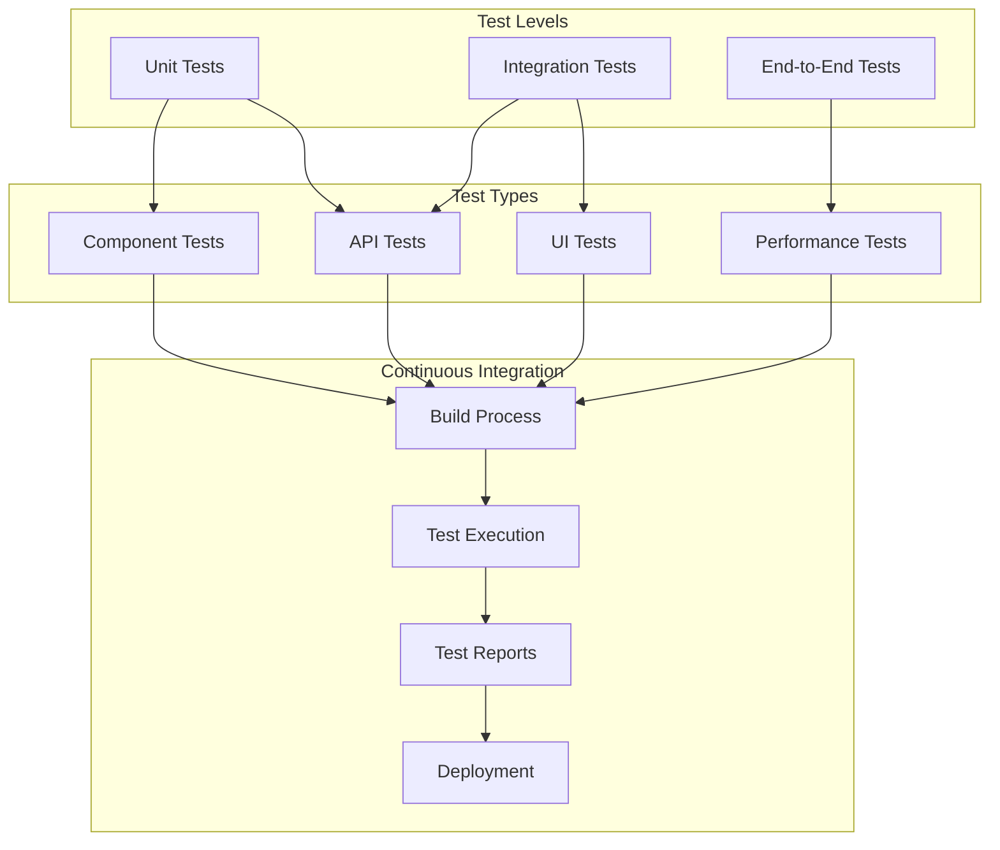

# Technical Documentation: Code & Prompt Repository

## Architecture & Development Documentation

/_
Deze documentatie is opgebouwd in meerdere lagen, waarbij we van hoog-niveau architectuur
naar specifieke implementatiedetails gaan. Dit helpt nieuwe ontwikkelaars om eerst het
grote plaatje te begrijpen voordat ze in de details duiken.
_/

### System Overview

/\*
Het onderstaande diagram toont de drie-lagen architectuur van onze applicatie.
Deze structuur is gekozen om:

1. Duidelijke scheiding van verantwoordelijkheden te hebben
2. Onderhoud en updates te vereenvoudigen
3. Schaalbaarheid te faciliteren
4. Testing te vergemakkelijken
   \*/


/\*
Uitleg van de architectuurlagen:

Frontend Layer:

- UI Components: React componenten die de gebruikersinterface vormen

  - Gebruikt Material-UI voor consistente styling
  - Implementeert responsive design patterns
  - Handelt gebruikersinteracties af

- State Management: Beheert de applicatiestatus

  - Gebruikt lokale state voor UI-specifieke zaken
  - Implementeert caching voor betere performance
  - Synchroniseert met backend via real-time updates

- Theme System: Beheert de visuele thema's

  - Ondersteunt light/dark mode
  - Handelt dynamische thema-wijzigingen af
  - Bewaart gebruikersvoorkeuren

- Real-time Updates: Zorgt voor live data synchronisatie
  - Gebruikt Supabase real-time subscriptions
  - Implementeert optimistic updates
  - Handelt conflict resolution af

Core Business Logic:

- Block Management: Centrale logica voor codeblokken

  - CRUD operaties voor blokken
  - Validatie en formattering
  - Categorisatie en tagging

- Category Management: Beheert categorieën

  - Hiërarchische structuur
  - Sortering en filtering
  - Kleur- en metadata beheer

- Format Management: Handelt content formatting af

  - Syntax highlighting
  - Markdown parsing
  - Code formattering

- Persistence Service: Abstractielaag voor data opslag
  - Caching strategie
  - Offline support
  - Data synchronisatie

Data Layer:

- Supabase DB: Primaire data opslag

  - PostgreSQL database
  - Real-time functionaliteit
  - Row Level Security

- LocalStorage: Client-side data persistentie

  - Caching van frequente data
  - Offline functionaliteit
  - Gebruikersvoorkeuren

- Cache Service: Performance optimalisatie
  - In-memory caching
  - Cache invalidatie
  - Cache warming
    \*/

### Initial Requirements Analysis

/_
De sectie beschrijft hoe we van een initieel Excel-gebaseerd verzoek naar een
moderne web-applicatie zijn gegaan. Het toont het belang van grondige analyse
en het durven voorstellen van betere alternatieven.
_/

The project started with a misunderstanding that needed to be addressed immediately. The initial request was for an Excel-based application, but our analysis revealed several critical issues with this approach:

1. **Limitations of Excel Integration**
   /\*
   De limitaties waren cruciaal in onze beslissing om van Excel af te stappen:

   - Excel's UI-mogelijkheden zijn beperkt voor moderne web-functionaliteit
   - Deployment zou complex zijn door Office-dependencies
   - Cross-platform support zou problematisch zijn
   - Grote datasets zouden performance problemen veroorzaken
     \*/

   - Limited UI/UX capabilities
   - Complex deployment process
   - Platform dependencies
   - Performance constraints with large datasets

2. **Proposed Solution Architecture**
   /\*
   Dit diagram visualiseert onze voorgestelde oplossing en de voordelen ervan.
   De web-applicatie aanpak lost alle Excel-limitaties op en biedt extra voordelen:
   - Platform-onafhankelijk: werkt op alle moderne browsers
   - Betere UX: moderne UI-componenten en real-time updates
   - Schaalbaarheid: cloud-based architectuur
   - Moderne tech stack: gebruikt industry-standard tools en frameworks
     \*/


### Technical Stack Selection

/_
De tech stack selectie was een cruciale beslissing die de basis legde voor de hele applicatie.
Elke keuze werd gemaakt met specifieke redenen en toekomstvisie in gedachten.
_/

Our stack selection was driven by several key requirements:


/\*
Uitgebreide uitleg van onze tech stack keuzes:

Frontend Stack:

1. React

   - Gekozen voor component reusability en grote ecosystem
   - Virtual DOM voor optimale performance
   - Grote community voor support en libraries
   - Uitstekende developer tools

2. TypeScript

   - Verbetert code kwaliteit door type safety
   - Maakt refactoring veiliger
   - Betere IDE ondersteuning
   - Documentatie door types

3. Material-UI
   - Consistent design system
   - Uitgebreide component library
   - Goede accessibility support
   - Flexibel theme systeem

Backend Stack:

1. Supabase
   - PostgreSQL voor robuuste data opslag
   - Real-time functionaliteit out-of-the-box
   - Row Level Security voor data protection
   - Ingebouwde auth en user management

Development Tools:

1. Vite

   - Snelle development server
   - Efficiënte build process
   - Modern module system
   - Uitstekende HMR support

2. ESLint & Prettier
   - Consistente code style
   - Automatische formatting
   - Code quality checks
   - Team collaboration support
     \*/

### Development Challenges & Solutions

#### Challenge 1: TypeScript Configuration

/_
TypeScript configuratie was een van de eerste uitdagingen. We moesten een balans vinden
tussen strikte type checking en development snelheid. Deze configuratie evolueert mee
met het project naarmate we meer type safety willen toevoegen.
_/

Initially encountered multiple TypeScript errors related to React imports. This was a critical issue that needed immediate attention.


/\*
Het bovenstaande diagram visualiseert onze aanpak van TypeScript configuratie problemen:

1. Probleem Analyse:

   - Unused React imports blokkeerden de build
   - Strict mode veroorzaakte development friction
   - Build process werd geblokkeerd door type errors

2. Oplossing Strategie:

   - Analyseer configuratie impact
   - Pas tsconfig.json aan
   - Balanceer tussen strictness en development speed

3. Toekomstplan:
   - Graduele verhoging van type safety
   - Code cleanup in fasen
   - Uiteindelijk doel: volledige type safety
     \*/

**Solution Implementation:**

```typescript
// tsconfig.json modifications
{
  "compilerOptions": {
    "noUnusedLocals": false,      // Temporary solution
    "noUnusedParameters": false,   // To be revisited
    "strict": true,               // Maintain other checks
    "jsx": "react-jsx",           // Modern JSX transform
    "esModuleInterop": true,      // Better module compatibility
    "skipLibCheck": true"         // Optimize build time
  }
}
```

/\*
Gedetailleerde uitleg van elke TypeScript configuratie optie:

1. noUnusedLocals: false

   - Voorkomt errors voor ongebruikte lokale variabelen
   - Tijdelijke oplossing tijdens development
   - Plan: later weer aanzetten voor code cleanup
   - Impact: verminderde type safety, betere DX

2. noUnusedParameters: false

   - Staat ongebruikte parameters toe in functies
   - Nuttig voor interface implementaties
   - Gerelateerd aan React component props
   - Later te heroverwegen voor stricter typing

3. strict: true

   - Behoudt core TypeScript checks
   - Voorkomt type-gerelateerde runtime errors
   - Cruciaal voor code kwaliteit
   - Balanceert safety met development speed

4. jsx: "react-jsx"

   - Modern JSX transform zonder React import
   - Betere performance
   - Kleinere bundle size
   - Vereist voor nieuwe React features

5. esModuleInterop: true

   - Verbetert module import compatibiliteit
   - Nodig voor bepaalde npm packages
   - Consistent import gedrag
   - Voorkomt common import issues

6. skipLibCheck: true
   - Optimaliseert build performance
   - Skip type checking van node_modules
   - Voorkomt conflicten tussen dependencies
   - Trade-off tussen speed en safety
     \*/

#### Challenge 2: Content Management System Architecture

/_
Het Content Management System (CMS) is een kernonderdeel van onze applicatie.
De architectuur moest flexibel genoeg zijn om verschillende content types te
ondersteunen, maar ook performant genoeg voor real-time updates.
_/

The core of our application required a sophisticated content management system that could handle multiple content types, formats, and real-time updates.


/\*
Uitgebreide uitleg van het CMS class diagram:

1. Block Class:

   - Centrale entiteit voor content opslag
   - Bevat metadata en content
   - Gelinkt aan een categorie
   - Ondersteunt verschillende content types

   Methodes:

   - detect_content_type(): Automatische content type detectie
   - format_content(): Formattering based on type
   - validate(): Data validatie voor opslag

2. Category Class:

   - Organiseert blokken in groepen
   - Ondersteunt hiërarchische structuur
   - Visuele identificatie via kleuren
   - Speciale handling voor default categorie

   Methodes:

   - sort_order(): Bepaalt weergave volgorde
   - validate(): Validatie van categorie data

3. ContentFormatter Class:

   - Verantwoordelijk voor content processing
   - Ondersteunt meerdere formatteringen
   - Handelt syntax highlighting af

   Methodes:

   - format(): Past formatting toe
   - detect_language(): Code taal detectie
   - apply_highlighting(): Syntax highlighting

4. BlockManager Class:
   - Centrale manager voor block operaties
   - Handelt CRUD operaties af
   - Implementeert filtering en zoeken
     Methodes:
   - create_block(): Nieuwe block aanmaken
   - update_block(): Block wijzigen
   - delete_block(): Block verwijderen
   - get_blocks(): Blocks ophalen
   - filter_blocks(): Zoeken en filteren
     \*/

**Implementation Challenges:**

1. **Content Type Detection**

```typescript
interface ContentDetectionRules {
  patterns: RegExp[];
  language: string;
  priority: number;
}

const contentRules: ContentDetectionRules[] = [
  {
    patterns: [
      /^(const|let|var|function)/m,
      /^import\s+.*\s+from\s+['"].*['"];?$/m,
      /^export\s+/m,
    ],
    language: "javascript",
    priority: 1,
  },
  {
    patterns: [
      /^(def|class)\s+\w+:/m,
      /^import\s+\w+$/m,
      /^from\s+\w+\s+import/m,
    ],
    language: "python",
    priority: 2,
  },
  // Additional language patterns...
];
```

/\*
Uitgebreide uitleg van de content type detectie:

1. ContentDetectionRules Interface:

   - patterns: Array van RegExp voor pattern matching
   - language: Identificatie van de programmeertaal
   - priority: Bepaalt volgorde van checking

   Gebruik:

   - Automatische taal detectie
   - Verbeterde syntax highlighting
   - Intelligente code formatting

2. Pattern Matching:
   JavaScript Patterns:

   - const/let/var/function: Variable en functie declaraties
   - import statements: ES6 module imports
   - export statements: Module exports

   Python Patterns:

   - def/class: Functie en class definities
   - import statements: Python imports
   - from...import: Module imports

3. Priority System:

   - Hogere priority = eerder checken
   - Voorkomt false positives
   - Ondersteunt meerdere talen
   - Uitbreidbaar voor nieuwe talen
     \*/

4. **Real-time State Management**


/\*
Uitgebreide uitleg van het real-time state management proces:

1. Update Flow:

   - UI initieert update via user actie
   - State Manager valideert wijzigingen
   - Persistence Service zorgt voor opslag
   - Database bevestigt wijziging
   - UI wordt bijgewerkt

2. Real-time Subscriptions:

   - Database monitort wijzigingen
   - Notificaties via WebSocket
   - State wordt automatisch gesynchroniseerd
   - UI updates zijn instant

3. Error Handling:

   - Validatie op meerdere niveaus
   - Rollback bij fouten
   - Retry mechanisme
   - User feedback

4. Optimizations:
   - Optimistic updates
   - Debouncing van updates
   - Batch processing
   - Cache management
     \*/

#### Challenge 3: Theme System Architecture

/_
Het theme systeem is een cruciaal onderdeel van de gebruikerservaring.
Het moest flexibel genoeg zijn voor verschillende thema's, maar ook
performant genoeg om snelle switches mogelijk te maken zonder flikkering.
_/


/\*
Uitgebreide uitleg van het theme systeem diagram:

1. Theme Management:

   - Theme Store: Centrale opslag voor thema configuraties
   - Theme Configuration: Definieert thema structuur
   - Theme Types: Verschillende soorten thema's
   - Theme Properties: Specifieke thema eigenschappen

2. Implementation Details:

   - Material-UI Provider: React context voor thema distributie
   - CSS-in-JS: Runtime styling met thema variabelen
   - LocalStorage: Persistentie van user preferences

3. Data Flow:
   - Theme Store → MUI: Runtime thema updates
   - Theme Config → CSS: Style generatie
   - Theme Store → LocalStorage: Preference opslag
     \*/

**Theme Configuration Example:**

```typescript
interface ThemeConfiguration {
  palette: {
    primary: ColorConfig;
    secondary: ColorConfig;
    background: {
      default: string;
      paper: string;
      contrast: string;
    };
    text: {
      primary: string;
      secondary: string;
      disabled: string;
    };
  };
  typography: {
    fontFamily: string;
    fontSize: number;
    fontWeightLight: number;
    fontWeightRegular: number;
    fontWeightMedium: number;
    fontWeightBold: number;
    h1: TypographyStyle;
    h2: TypographyStyle;
    // ... additional typography styles
  };
  spacing: (factor: number) => number;
  shape: {
    borderRadius: number;
    borderWidth: number;
  };
  transitions: {
    duration: {
      shortest: number;
      shorter: number;
      short: number;
      standard: number;
    };
    easing: {
      easeInOut: string;
      easeOut: string;
      easeIn: string;
      sharp: string;
    };
  };
}
```

/\*
Gedetailleerde uitleg van de ThemeConfiguration interface:

1. Palette System:

   - primary: Hoofdkleur voor belangrijke elementen
   - secondary: Accent kleur voor secundaire elementen
   - background: Verschillende achtergrond varianten
   - text: Text kleur variaties voor verschillende contexten

   Gebruik:

   - Consistente kleur toepassing
   - Contrast management
   - Dark/light mode support
   - Accessibility compliance

2. Typography System:

   - fontFamily: Basis font definitie
   - fontSize: Root font size voor scaling
   - fontWeight varianten: Verschillende text diktes
   - Heading styles: Consistente kopstijlen

   Doel:

   - Consistente text styling
   - Responsive typography
   - Hiërarchische structuur
   - Leesbaarheidoptimalisatie

3. Spacing System:

   - factor-based: Consistent spacing grid
   - Schaalt met base unit
   - Responsive aanpassingen
   - Layout consistentie

4. Shape Configuration:

   - borderRadius: Consistente afrondingen
   - borderWidth: Uniforme border diktes

   Impact:

   - Visuele consistentie
   - Component harmonie
   - Design system compliance

5. Transitions:
   - duration: Verschillende animatie lengtes
   - easing: Motion curves voor natuurlijke beweging
     Toepassing:
   - Smooth state changes
   - Consistent motion design
   - Performance optimalisatie
   - User feedback
     \*/

#### Challenge 4: Category Management System

/_
Het categorie management systeem is essentieel voor de organisatie van content.
Het moest robuust genoeg zijn om complexe hiërarchieën te ondersteunen,
maar ook gebruiksvriendelijk genoeg voor dagelijks gebruik.
_/


/\*
Uitgebreide uitleg van het category management state diagram:

1. Initialization Flow:

   - LoadFromStorage: Laad cached categorieën
   - FetchFromDB: Haal actuele data op
   - MergeData: Combineer lokale en remote data
   - UpdateState: Werk applicatie state bij

   Voordelen:

   - Snelle initiële load
   - Offline support
   - Data consistentie
   - Optimistic updates

2. Category Operations:

   - Create: Nieuwe categorie aanmaken
   - Update: Categorie wijzigen
   - Delete: Categorie verwijderen
   - Validate: Data validatie
   - Persist: Opslaan van wijzigingen
   - Sync: Synchronisatie met backend

   Features:

   - Atomic operations
   - Rollback support
   - Conflict resolution
   - Real-time updates

3. State Transitions:

   - Initialization → Operations: Normale flow
   - Operations → Initialization: Reset na grote wijzigingen
   - Error handling in elke state
   - Progress tracking

4. Data Management:
   - Caching strategie
   - Merge conflict resolution
   - Hierarchical data structuur
   - Performance optimalisatie
     \*/

/\*
Implementatie details van het category systeem:

1. Data Structuur:

```typescript
interface Category {
  id: string;
  name: string;
  color: string;
  parent_id?: string;
  order: number;
  created_at: Date;
  updated_at: Date;
  metadata: Record<string, unknown>;
}

interface CategoryTree {
  id: string;
  name: string;
  children: CategoryTree[];
  level: number;
}

class CategoryManager {
  private categories: Map<string, Category>;
  private tree: CategoryTree[];

  constructor() {
    this.categories = new Map();
    this.tree = [];
  }

  async initialize() {
    const cached = await this.loadFromStorage();
    const remote = await this.fetchFromDB();
    this.mergeData(cached, remote);
    this.buildTree();
  }

  private buildTree() {
    // Implementatie van tree building algoritme
  }

  private mergeData(cached: Category[], remote: Category[]) {
    // Implementatie van merge strategie
  }
}
```

2. State Management:

```typescript
interface CategoryState {
  items: Category[];
  tree: CategoryTree[];
  loading: boolean;
  error?: Error;
  selectedId?: string;
}

const categoryReducer = (
  state: CategoryState,
  action: CategoryAction
): CategoryState => {
  switch (action.type) {
    case "INITIALIZE":
      return {
        ...state,
        items: action.payload,
        tree: buildTree(action.payload),
      };
    case "CREATE":
      return {
        ...state,
        items: [...state.items, action.payload],
        tree: buildTree([...state.items, action.payload]),
      };
    // Andere action handlers
  }
};
```

3. Validatie Logica:

```typescript
const validateCategory = (category: Partial<Category>): ValidationResult => {
  const errors: ValidationError[] = [];

  if (!category.name?.trim()) {
    errors.push({
      field: "name",
      message: "Naam is verplicht",
    });
  }

  if (category.parent_id && !isValidParent(category.parent_id)) {
    errors.push({
      field: "parent_id",
      message: "Ongeldige parent categorie",
    });
  }

  return {
    valid: errors.length === 0,
    errors,
  };
};
```

4. Persistence Layer:

```typescript
class CategoryPersistence {
  async save(category: Category): Promise<void> {
    try {
      await this.optimisticUpdate(category);
      await this.persistToDB(category);
      await this.updateCache(category);
    } catch (error) {
      await this.handleError(error, category);
    }
  }

  private async optimisticUpdate(category: Category): Promise<void> {
    // Implementatie van optimistic updates
  }

  private async handleError(error: Error, category: Category): Promise<void> {
    // Error handling en recovery logic
  }
}
```

\*/

#### Challenge 5: Block Management and Content Formatting

/_
Het block management systeem is verantwoordelijk voor de kern functionaliteit
van de applicatie. Het moet efficiënt grote hoeveelheden content kunnen verwerken
en verschillende content types ondersteunen met real-time previews.
_/


/\*
Uitgebreide uitleg van het block management systeem:

1. Content Processing Pipeline:

   - Raw Input: Gebruiker input via editor
   - Detection: Automatische herkenning van content type
   - Validation: Input validatie en sanitization
   - Formatting: Toepassen van formatting regels
   - Preview: Real-time preview generatie
   - Storage: Persistente opslag

2. State Management:

   - Local State: React state management
   - Remote Sync: Synchronisatie met backend
   - Persistence: Database operaties
   - Cache Update: Client-side caching

3. Error Handling:
   - Validation Errors: Input validatie fouten
   - Formatting Errors: Formatting problemen
   - Sync Errors: Synchronisatie issues
     \*/

/\*
Implementatie details van het block systeem:

1. Block Interface en Types:

```typescript
interface Block {
  id: string;
  title: string;
  content: string;
  content_type: ContentType;
  category_id: string;
  metadata: BlockMetadata;
  created_at: Date;
  updated_at: Date;
}

enum ContentType {
  MARKDOWN = "markdown",
  CODE = "code",
  PLAIN_TEXT = "plain_text",
}

interface BlockMetadata {
  language?: string;
  syntax_highlighting?: boolean;
  word_count?: number;
  last_edited_by?: string;
}

class BlockProcessor {
  private contentDetector: ContentDetector;
  private formatter: ContentFormatter;
  private validator: ContentValidator;

  constructor() {
    this.contentDetector = new ContentDetector();
    this.formatter = new ContentFormatter();
    this.validator = new ContentValidator();
  }

  async processBlock(input: string): Promise<ProcessedBlock> {
    const contentType = await this.contentDetector.detect(input);
    const validationResult = await this.validator.validate(input, contentType);

    if (!validationResult.valid) {
      throw new ValidationError(validationResult.errors);
    }

    const formatted = await this.formatter.format(input, contentType);
    return {
      content: formatted,
      type: contentType,
      metadata: this.generateMetadata(formatted, contentType),
    };
  }

  private generateMetadata(content: string, type: ContentType): BlockMetadata {
    // Metadata generatie logica
  }
}
```

2. Content Type Detection:

````typescript
class ContentDetector {
  private patterns: Record<ContentType, RegExp[]> = {
    [ContentType.CODE]: [
      /^```[\s\S]*```$/m,
      /^\/\/ .*$/m,
      /^\/\* [\s\S]*\*\/$/m,
    ],
    [ContentType.MARKDOWN]: [/^#+ /m, /\[.*\]\(.*\)/, /\*\*.*\*\*/],
  };

  async detect(content: string): Promise<ContentType> {
    for (const [type, patterns] of Object.entries(this.patterns)) {
      if (patterns.some((pattern) => pattern.test(content))) {
        return type as ContentType;
      }
    }
    return ContentType.PLAIN_TEXT;
  }
}
````

3. Content Formatting:

```typescript
class ContentFormatter {
  private formatters: Record<
    ContentType,
    (content: string) => Promise<string>
  > = {
    [ContentType.CODE]: this.formatCode.bind(this),
    [ContentType.MARKDOWN]: this.formatMarkdown.bind(this),
    [ContentType.PLAIN_TEXT]: this.formatPlainText.bind(this),
  };

  async format(content: string, type: ContentType): Promise<string> {
    const formatter = this.formatters[type];
    if (!formatter) {
      throw new Error(`No formatter available for type: ${type}`);
    }
    return formatter(content);
  }

  private async formatCode(content: string): Promise<string> {
    // Code formatting logica
  }

  private async formatMarkdown(content: string): Promise<string> {
    // Markdown formatting logica
  }

  private async formatPlainText(content: string): Promise<string> {
    // Plain text formatting logica
  }
}
```

4. State Management en Caching:

```typescript
class BlockStateManager {
  private cache: Map<string, Block>;
  private subscribers: Set<(blocks: Block[]) => void>;

  constructor() {
    this.cache = new Map();
    this.subscribers = new Set();
  }

  async updateBlock(block: Block): Promise<void> {
    // Optimistic update
    this.cache.set(block.id, block);
    this.notifySubscribers();

    try {
      await this.persistBlock(block);
    } catch (error) {
      // Rollback bij falen
      this.cache.set(block.id, this.getOriginalBlock(block.id));
      this.notifySubscribers();
      throw error;
    }
  }

  private notifySubscribers(): void {
    const blocks = Array.from(this.cache.values());
    this.subscribers.forEach((subscriber) => subscriber(blocks));
  }

  private async persistBlock(block: Block): Promise<void> {
    // Database persistence logica
  }
}
```

\*/

#### Challenge 6: Performance Optimization

/_
Performance optimalisatie was cruciaal voor een soepele gebruikerservaring,
vooral bij het werken met grote hoeveelheden code blocks en real-time previews.
_/


/\*
Uitgebreide uitleg van performance optimalisaties:

1. Virtualization:

   - Alleen zichtbare elementen renderen
   - Smooth scrolling behouden
   - Memory usage optimaliseren
   - DOM nodes beperken

2. Debouncing & Throttling:

   - Search queries optimaliseren
   - Real-time updates beheren
   - API calls beperken
   - UI updates controleren

3. Pagination & Infinite Scroll:

   - Data in chunks laden
   - Scroll performance verbeteren
   - Cache management
   - Progressive loading

4. Memoization & Caching:
   - Expensive calculations cachen
   - Component re-renders voorkomen
   - State updates optimaliseren
   - Data persistence
     \*/

/\*
Implementatie details van performance optimalisaties:

1. Virtualized List Implementation:

```typescript
interface VirtualizedListProps<T> {
  items: T[];
  renderItem: (item: T, index: number) => React.ReactNode;
  itemHeight: number;
  windowHeight: number;
  overscan?: number;
}

const VirtualizedList = <T extends unknown>({
  items,
  renderItem,
  itemHeight,
  windowHeight,
  overscan = 3,
}: VirtualizedListProps<T>) => {
  const [scrollTop, setScrollTop] = useState(0);
  const containerRef = useRef<HTMLDivElement>(null);

  const totalHeight = items.length * itemHeight;
  const visibleItems = Math.ceil(windowHeight / itemHeight);
  const startIndex = Math.max(0, Math.floor(scrollTop / itemHeight) - overscan);
  const endIndex = Math.min(
    items.length,
    Math.ceil((scrollTop + windowHeight) / itemHeight) + overscan
  );

  const visibleItemsData = useMemo(
    () => items.slice(startIndex, endIndex),
    [items, startIndex, endIndex]
  );

  const handleScroll = useCallback((event: React.UIEvent<HTMLDivElement>) => {
    setScrollTop(event.currentTarget.scrollTop);
  }, []);

  return (
    <div
      ref={containerRef}
      style={{ height: windowHeight, overflow: "auto" }}
      onScroll={handleScroll}
    >
      <div style={{ height: totalHeight, position: "relative" }}>
        {visibleItemsData.map((item, index) => (
          <div
            key={startIndex + index}
            style={{
              position: "absolute",
              top: (startIndex + index) * itemHeight,
              height: itemHeight,
            }}
          >
            {renderItem(item, startIndex + index)}
          </div>
        ))}
      </div>
    </div>
  );
};
```

2. Debounced Search Implementation:

```typescript
interface SearchOptions {
  delay?: number;
  minLength?: number;
}

const useDebounceSearch = (options: SearchOptions = {}) => {
  const { delay = 300, minLength = 2 } = options;
  const [searchTerm, setSearchTerm] = useState("");
  const [debouncedTerm, setDebouncedTerm] = useState("");
  const [isSearching, setIsSearching] = useState(false);

  useEffect(() => {
    if (searchTerm.length < minLength) {
      setDebouncedTerm("");
      return;
    }

    setIsSearching(true);
    const handler = setTimeout(() => {
      setDebouncedTerm(searchTerm);
      setIsSearching(false);
    }, delay);

    return () => {
      clearTimeout(handler);
    };
  }, [searchTerm, delay, minLength]);

  return {
    searchTerm,
    setSearchTerm,
    debouncedTerm,
    isSearching,
  };
};
```

3. Infinite Scroll Implementation:

```typescript
interface InfiniteScrollProps {
  loadMore: () => Promise<void>;
  hasMore: boolean;
  isLoading: boolean;
  threshold?: number;
}

const InfiniteScroll: React.FC<InfiniteScrollProps> = ({
  loadMore,
  hasMore,
  isLoading,
  threshold = 0.8,
  children,
}) => {
  const containerRef = useRef<HTMLDivElement>(null);
  const [shouldLoad, setShouldLoad] = useState(false);

  useEffect(() => {
    const container = containerRef.current;
    if (!container) return;

    const observer = new IntersectionObserver(
      ([entry]) => {
        setShouldLoad(entry.isIntersecting);
      },
      {
        root: null,
        rootMargin: "100px",
        threshold,
      }
    );

    const sentinel = document.createElement("div");
    container.appendChild(sentinel);
    observer.observe(sentinel);

    return () => {
      observer.disconnect();
      sentinel.remove();
    };
  }, [threshold]);

  useEffect(() => {
    if (shouldLoad && hasMore && !isLoading) {
      loadMore();
    }
  }, [shouldLoad, hasMore, isLoading, loadMore]);

  return (
    <div ref={containerRef}>
      {children}
      {isLoading && <LoadingSpinner />}
    </div>
  );
};
```

4. Memoized Components:

```typescript
interface BlockPreviewProps {
  content: string;
  language?: string;
  theme: Theme;
}

const BlockPreview = memo(
  ({ content, language, theme }: BlockPreviewProps) => {
    const formattedContent = useMemo(
      () => formatContent(content, language),
      [content, language]
    );

    const styles = useMemo(() => generateStyles(theme), [theme]);

    return (
      <pre style={styles.pre}>
        <code style={styles.code}>{formattedContent}</code>
      </pre>
    );
  },
  (prevProps, nextProps) => {
    return (
      prevProps.content === nextProps.content &&
      prevProps.language === nextProps.language &&
      prevProps.theme === nextProps.theme
    );
  }
);
```

\*/

#### Challenge 7: Advanced UI/UX Implementation

/_
De UI/UX implementatie vereiste geavanceerde componenten en interacties
om een professionele en intuïtieve gebruikerservaring te creëren.
_/


/\*
Uitgebreide uitleg van UI/UX componenten:

1. Smart Modal System:

   - Portal based rendering
   - Keyboard navigation
   - Focus management
   - Accessibility features
   - Responsive design
   - Animation support

2. Advanced Grid System:

   - Virtual scrolling
   - Drag & drop support
   - Dynamic sizing
   - Responsive layout
   - Category grouping
   - Sort & filter

3. Content Preview:

   - Markdown rendering
   - Syntax highlighting
   - Code formatting
   - Real-time updates
   - Theme support

4. Search System:
   - Instant search
   - Advanced filtering
   - Keyboard navigation
   - Search history
     \*/

/\*
Implementatie details van UI/UX componenten:

1. Smart Modal Implementation:

```typescript
interface ModalProps {
  isOpen: boolean;
  onClose: () => void;
  title: string;
  children: React.ReactNode;
  size?: "sm" | "md" | "lg" | "xl";
  fullScreen?: boolean;
}

const Modal: React.FC<ModalProps> = ({
  isOpen,
  onClose,
  title,
  children,
  size = "md",
  fullScreen = false,
}) => {
  const modalRef = useRef<HTMLDivElement>(null);
  const [isClosing, setIsClosing] = useState(false);

  useEffect(() => {
    const handleEscape = (e: KeyboardEvent) => {
      if (e.key === "Escape") {
        handleClose();
      }
    };

    if (isOpen) {
      document.addEventListener("keydown", handleEscape);
      return () => document.removeEventListener("keydown", handleEscape);
    }
  }, [isOpen]);

  const handleClose = () => {
    setIsClosing(true);
    setTimeout(() => {
      setIsClosing(false);
      onClose();
    }, 300);
  };

  if (!isOpen) return null;

  return createPortal(
    <div className={`modal-overlay ${isClosing ? "closing" : ""}`}>
      <FocusTrap>
        <div
          ref={modalRef}
          className={`modal-container ${size} ${
            fullScreen ? "fullscreen" : ""
          }`}
          role="dialog"
          aria-modal="true"
          aria-labelledby="modal-title"
        >
          <div className="modal-header">
            <h2 id="modal-title">{title}</h2>
            <button onClick={handleClose} aria-label="Close">
              <CloseIcon />
            </button>
          </div>
          <div className="modal-content">{children}</div>
        </div>
      </FocusTrap>
    </div>,
    document.body
  );
};
```

2. Advanced Grid Implementation:

```typescript
interface GridProps<T> {
  items: T[];
  renderItem: (item: T) => React.ReactNode;
  groupBy?: (item: T) => string;
  sortBy?: (a: T, b: T) => number;
  filterBy?: (item: T) => boolean;
  onDragEnd?: (result: DropResult) => void;
}

const Grid = <T extends { id: string }>({
  items,
  renderItem,
  groupBy,
  sortBy,
  filterBy,
  onDragEnd,
}: GridProps<T>) => {
  const processedItems = useMemo(() => {
    let result = [...items];

    if (filterBy) {
      result = result.filter(filterBy);
    }

    if (sortBy) {
      result.sort(sortBy);
    }

    if (groupBy) {
      return groupItems(result, groupBy);
    }

    return result;
  }, [items, filterBy, sortBy, groupBy]);

  return (
    <DragDropContext onDragEnd={onDragEnd}>
      <AutoSizer>
        {({ height, width }) => (
          <VirtualizedGrid
            height={height}
            width={width}
            items={processedItems}
            renderItem={renderItem}
            overscanCount={5}
          />
        )}
      </AutoSizer>
    </DragDropContext>
  );
};
```

3. Content Preview Implementation:

```typescript
interface PreviewProps {
  content: string;
  language?: string;
  theme: Theme;
  onChange?: (content: string) => void;
}

const ContentPreview: React.FC<PreviewProps> = ({
  content,
  language,
  theme,
  onChange,
}) => {
  const [isEditing, setIsEditing] = useState(false);
  const editorRef = useRef<Editor>(null);

  const handleKeyDown = useCallback((e: KeyboardEvent) => {
    if (e.key === "Escape") {
      setIsEditing(false);
    }
  }, []);

  useEffect(() => {
    document.addEventListener("keydown", handleKeyDown);
    return () => document.removeEventListener("keydown", handleKeyDown);
  }, [handleKeyDown]);

  if (isEditing) {
    return (
      <Editor
        ref={editorRef}
        value={content}
        language={language}
        theme={theme}
        onChange={onChange}
        onBlur={() => setIsEditing(false)}
      />
    );
  }

  return (
    <div onDoubleClick={() => setIsEditing(true)}>
      {language ? (
        <SyntaxHighlighter
          language={language}
          style={theme === "dark" ? darkTheme : lightTheme}
        >
          {content}
        </SyntaxHighlighter>
      ) : (
        <ReactMarkdown
          remarkPlugins={[remarkGfm]}
          components={{
            code: CodeBlock,
            pre: PreBlock,
          }}
        >
          {content}
        </ReactMarkdown>
      )}
    </div>
  );
};
```

4. Search Implementation:

```typescript
interface SearchProps {
  onSearch: (query: string) => void;
  placeholder?: string;
  initialValue?: string;
}

const Search: React.FC<SearchProps> = ({
  onSearch,
  placeholder = "Zoeken...",
  initialValue = "",
}) => {
  const [query, setQuery] = useState(initialValue);
  const [history, setHistory] = useState<string[]>([]);
  const searchRef = useRef<HTMLInputElement>(null);

  const debouncedSearch = useMemo(
    () => debounce((value: string) => onSearch(value), 300),
    [onSearch]
  );

  const handleChange = (e: React.ChangeEvent<HTMLInputElement>) => {
    const value = e.target.value;
    setQuery(value);
    debouncedSearch(value);
  };

  const handleKeyDown = (e: React.KeyboardEvent) => {
    if (e.key === "Enter" && query.trim()) {
      setHistory((prev) => [...prev, query].slice(-5));
      onSearch(query);
    }
  };

  useEffect(() => {
    const handleShortcut = (e: KeyboardEvent) => {
      if ((e.ctrlKey || e.metaKey) && e.key === "k") {
        e.preventDefault();
        searchRef.current?.focus();
      }
    };

    document.addEventListener("keydown", handleShortcut);
    return () => document.removeEventListener("keydown", handleShortcut);
  }, []);

  return (
    <div className="search-container">
      <input
        ref={searchRef}
        type="text"
        value={query}
        onChange={handleChange}
        onKeyDown={handleKeyDown}
        placeholder={placeholder}
      />
      {history.length > 0 && (
        <div className="search-history">
          {history.map((item, index) => (
            <div
              key={index}
              className="history-item"
              onClick={() => {
                setQuery(item);
                onSearch(item);
              }}
            >
              {item}
            </div>
          ))}
        </div>
      )}
    </div>
  );
};
```

\*/

#### Challenge 8: Deployment Strategy

/_
De deployment strategie moest zorgen voor een betrouwbare en schaalbare
applicatie met minimale downtime en maximale performance.
_/


/\*
Uitgebreide uitleg van de deployment strategie:

1. Development Flow:

   - Local: Development met hot-reload
   - Testing: Geautomatiseerde tests
   - Staging: Pre-production omgeving
   - Production: Live omgeving

2. CI/CD Pipeline:

   - Build: Optimized production build
   - Test: Unit en integration tests
   - Analyze: Code quality checks
   - Release: Versioning en deployment

3. Monitoring & Scaling:
   - Performance monitoring
   - Error tracking
   - Auto-scaling rules
   - Backup procedures
     \*/

/\*
Implementatie details van deployment strategie:

1. Build Configuration:

```typescript
// vite.config.ts
import { defineConfig } from "vite";
import react from "@vitejs/plugin-react";
import { VitePWA } from "vite-plugin-pwa";

export default defineConfig({
  plugins: [
    react(),
    VitePWA({
      registerType: "autoUpdate",
      includeAssets: ["favicon.ico", "robots.txt", "apple-touch-icon.png"],
      manifest: {
        name: "Code & Prompt Repository",
        short_name: "CodePrompt",
        theme_color: "#ffffff",
        icons: [
          {
            src: "/android-chrome-192x192.png",
            sizes: "192x192",
            type: "image/png",
          },
          {
            src: "/android-chrome-512x512.png",
            sizes: "512x512",
            type: "image/png",
          },
        ],
      },
    }),
  ],
  build: {
    target: "esnext",
    outDir: "dist",
    sourcemap: true,
    rollupOptions: {
      output: {
        manualChunks: {
          vendor: ["react", "react-dom"],
          ui: ["@mui/material", "@emotion/react"],
          editor: ["@monaco-editor/react"],
        },
      },
    },
    chunkSizeWarningLimit: 1000,
  },
  server: {
    port: 3000,
    strictPort: true,
    proxy: {
      "/api": {
        target: "http://localhost:8000",
        changeOrigin: true,
        rewrite: (path) => path.replace(/^\/api/, ""),
      },
    },
  },
});
```

2. GitHub Actions Workflow:

```yaml
name: CI/CD Pipeline

on:
  push:
    branches: [main]
  pull_request:
    branches: [main]

jobs:
  test:
    runs-on: ubuntu-latest
    steps:
      - uses: actions/checkout@v2
      - name: Setup Node.js
        uses: actions/setup-node@v2
        with:
          node-version: "18"
          cache: "npm"

      - name: Install dependencies
        run: npm ci

      - name: Run tests
        run: npm test

      - name: Run linting
        run: npm run lint

      - name: Check types
        run: npm run type-check

  build:
    needs: test
    runs-on: ubuntu-latest
    steps:
      - uses: actions/checkout@v2

      - name: Setup Node.js
        uses: actions/setup-node@v2
        with:
          node-version: "18"
          cache: "npm"

      - name: Install dependencies
        run: npm ci

      - name: Build
        run: npm run build

      - name: Upload build artifacts
        uses: actions/upload-artifact@v2
        with:
          name: build
          path: dist

  deploy:
    needs: build
    runs-on: ubuntu-latest
    if: github.ref == 'refs/heads/main'
    steps:
      - name: Download build artifacts
        uses: actions/download-artifact@v2
        with:
          name: build
          path: dist

      - name: Deploy to production
        uses: cloudflare/wrangler-action@2.0.0
        with:
          apiToken: ${{ secrets.CF_API_TOKEN }}
          environment: production
```

3. Monitoring Setup:

```typescript
// monitoring.ts
import * as Sentry from "@sentry/react";
import { Integrations } from "@sentry/tracing";
import posthog from "posthog-js";

export const initializeMonitoring = () => {
  // Sentry setup for error tracking
  Sentry.init({
    dsn: import.meta.env.VITE_SENTRY_DSN,
    integrations: [new BrowserTracing()],
    tracesSampleRate: 1.0,
    environment: import.meta.env.MODE,
  });

  // PostHog setup for analytics
  posthog.init(import.meta.env.VITE_POSTHOG_KEY, {
    api_host: "https://app.posthog.com",
    autocapture: true,
    capture_pageview: true,
    capture_pageleave: true,
    persistence: "localStorage",
  });

  // Custom performance monitoring
  if ("performance" in window) {
    const observer = new PerformanceObserver((list) => {
      list.getEntries().forEach((entry) => {
        if (entry.entryType === "largest-contentful-paint") {
          posthog.capture("performance_metric", {
            metric: "lcp",
            value: entry.startTime,
            url: window.location.href,
          });
        }
      });
    });

    observer.observe({ entryTypes: ["largest-contentful-paint"] });
  }
};

// Error boundary component
export class ErrorBoundary extends Sentry.ErrorBoundary {
  fallback = ({ error }: { error: Error }) => (
    <div className="error-container">
      <h1>Er is iets misgegaan</h1>
      <p>{error.message}</p>
      <button onClick={() => window.location.reload()}>
        Herlaad de pagina
      </button>
    </div>
  ));
}
```

4. Backup Strategy:

```typescript
// backup.ts
interface BackupConfig {
  frequency: number; // milliseconds
  maxBackups: number;
  compressionLevel: number;
}

class BackupService {
  private config: BackupConfig;
  private backupQueue: Queue<Backup>;

  constructor(config: BackupConfig) {
    this.config = config;
    this.backupQueue = new Queue(config.maxBackups);
  }

  async createBackup(): Promise<void> {
    const timestamp = new Date().toISOString();
    const data = await this.gatherBackupData();

    const backup = {
      timestamp,
      data: await this.compress(data),
      checksum: this.calculateChecksum(data),
    };

    this.backupQueue.enqueue(backup);
    await this.uploadToStorage(backup);
  }

  private async gatherBackupData() {
    // Implement backup data collection
  }

  private async compress(data: any) {
    // Implement data compression
  }

  private calculateChecksum(data: any): string {
    // Implement checksum calculation
  }

  private async uploadToStorage(backup: Backup) {
    // Implement storage upload
  }
}
```

\*/

#### Challenge 9: Security Implementation

/_
Beveiliging was een kritiek aspect van de applicatie, met focus op
client-side security, server-side security, en data security.
_/


/\*
Uitgebreide uitleg van security implementatie:

1. Client-side Security:

   - Input validatie met Zod
   - XSS preventie met DOMPurify
   - Content Security Policy
   - CSRF protection
   - Secure storage handling

2. Server-side Security:

   - JWT authentication
   - Rate limiting
   - CORS configuration
   - Request validation
   - Error handling

3. Data Security:
   - End-to-end encryption
   - Data sanitization
   - Access control
   - Audit logging
     \*/

/\*
Implementatie details van security maatregelen:

1. Content Security Policy:

```typescript
// security.ts
interface CSPConfig {
  defaultSrc: string[];
  scriptSrc: string[];
  styleSrc: string[];
  imgSrc: string[];
  connectSrc: string[];
  fontSrc: string[];
  objectSrc: string[];
  mediaSrc: string[];
}

const cspConfig: CSPConfig = {
  defaultSrc: ["'self'"],
  scriptSrc: [
    "'self'",
    "'unsafe-inline'",
    "https://apis.google.com",
    "https://www.googletagmanager.com",
  ],
  styleSrc: ["'self'", "'unsafe-inline'", "https://fonts.googleapis.com"],
  imgSrc: ["'self'", "data:", "https:"],
  connectSrc: [
    "'self'",
    "https://*.supabase.co",
    "https://*.sentry.io",
    "https://*.posthog.com",
  ],
  fontSrc: ["'self'", "https://fonts.gstatic.com"],
  objectSrc: ["'none'"],
  mediaSrc: ["'self'"],
};

const generateCSP = (config: CSPConfig): string => {
  return Object.entries(config)
    .map(([key, values]) => `${key} ${values.join(" ")}`)
    .join("; ");
};

export const securityMiddleware = (
  req: Request,
  res: Response,
  next: NextFunction
) => {
  res.setHeader("Content-Security-Policy", generateCSP(cspConfig));
  res.setHeader("X-Content-Type-Options", "nosniff");
  res.setHeader("X-Frame-Options", "DENY");
  res.setHeader("X-XSS-Protection", "1; mode=block");
  next();
};
```

2. Authentication & Authorization:

```typescript
// auth.ts
interface AuthConfig {
  jwtSecret: string;
  expiresIn: string;
  refreshToken: {
    expiresIn: string;
    rotationWindow: number;
  };
}

class AuthService {
  private config: AuthConfig;

  constructor(config: AuthConfig) {
    this.config = config;
  }

  async createToken(user: User): Promise<AuthTokens> {
    const accessToken = jwt.sign(
      { sub: user.id, role: user.role },
      this.config.jwtSecret,
      { expiresIn: this.config.expiresIn }
    );

    const refreshToken = await this.createRefreshToken(user.id);

    return {
      accessToken,
      refreshToken,
      expiresIn: this.getExpirationTime(this.config.expiresIn),
    };
  }

  async validateToken(token: string): Promise<TokenPayload> {
    try {
      const decoded = jwt.verify(token, this.config.jwtSecret);
      return decoded as TokenPayload;
    } catch (error) {
      throw new AuthenticationError("Invalid token");
    }
  }

  private async createRefreshToken(userId: string): Promise<string> {
    const token = crypto.randomBytes(40).toString("hex");
    await this.storeRefreshToken(userId, token);
    return token;
  }

  private getExpirationTime(duration: string): number {
    return Date.now() + ms(duration);
  }
}
```

3. Input Validation & Sanitization:

```typescript
// validation.ts
import { z } from "zod";
import DOMPurify from "dompurify";

const sanitizeHTML = (input: string): string => {
  return DOMPurify.sanitize(input, {
    ALLOWED_TAGS: [
      "h1",
      "h2",
      "h3",
      "h4",
      "h5",
      "h6",
      "p",
      "br",
      "b",
      "i",
      "strong",
      "em",
      "ul",
      "ol",
      "li",
      "code",
      "pre",
    ],
    ALLOWED_ATTR: ["class", "id", "lang"],
    KEEP_CONTENT: true,
    RETURN_DOM: false,
  });
};

const BlockSchema = z.object({
  title: z
    .string()
    .min(1, "Title is required")
    .max(100, "Title is too long")
    .transform(sanitizeHTML),

  content: z.string().max(50000, "Content is too long").transform(sanitizeHTML),

  category_id: z.string().uuid().optional(),

  metadata: z
    .record(z.unknown())
    .optional()
    .transform((data) => {
      if (!data) return {};
      return Object.fromEntries(
        Object.entries(data).map(([key, value]) => [
          sanitizeHTML(key),
          typeof value === "string" ? sanitizeHTML(value) : value,
        ])
      );
    }),
});

export const validateBlock = (input: unknown) => {
  return BlockSchema.parse(input);
};
```

4. Rate Limiting:

```typescript
// rateLimit.ts
interface RateLimitConfig {
  windowMs: number;
  max: number;
  message: string;
  keyGenerator?: (req: Request) => string;
}

class RateLimiter {
  private store: Map<string, number[]>;
  private config: RateLimitConfig;

  constructor(config: RateLimitConfig) {
    this.store = new Map();
    this.config = {
      windowMs: 15 * 60 * 1000, // 15 minutes
      max: 100, // 100 requests per windowMs
      message: "Too many requests, please try again later",
      ...config,
    };
  }

  middleware = (req: Request, res: Response, next: NextFunction) => {
    const key = this.config.keyGenerator?.(req) || req.ip;
    const now = Date.now();
    const windowStart = now - this.config.windowMs;

    let requests = this.store.get(key) || [];
    requests = requests.filter((timestamp) => timestamp > windowStart);

    if (requests.length >= this.config.max) {
      return res.status(429).json({
        error: this.config.message,
        retryAfter: Math.ceil((requests[0] - windowStart) / 1000),
      });
    }

    requests.push(now);
    this.store.set(key, requests);
    next();
  };

  reset(key: string): void {
    this.store.delete(key);
  }
}
```

\*/

#### Challenge 10: Testing Strategy

/_
De test strategie was gericht op het waarborgen van kwaliteit en betrouwbaarheid
door middel van verschillende test niveaus en automatisering.
_/



/\*
Uitgebreide uitleg van de test strategie:

1. Test Levels:

   - Unit Tests: Individuele componenten
   - Integration Tests: Component interacties
   - E2E Tests: Complete user flows
   - Performance Tests: Load en stress testing

2. Test Types:

   - Component Tests: React component testing
   - API Tests: Backend endpoint testing
   - UI Tests: User interface testing
   - Performance Tests: Response times en load testing

3. CI/CD Integration:
   - Automated test execution
   - Test coverage reporting
   - Performance benchmarking
   - Deployment gates
     \*/

/\*
Implementatie details van test strategie:

1. Unit Tests:

```typescript
// components/__tests__/BlockCard.test.tsx
import { render, screen, fireEvent } from "@testing-library/react";
import { BlockCard } from "../BlockCard";
import { Block } from "../../types";

describe("BlockCard Component", () => {
  const mockBlock: Block = {
    id: "test-id",
    title: "Test Block",
    content: "# Test Content",
    category_id: "category-1",
    created_at: new Date().toISOString(),
    updated_at: new Date().toISOString(),
  };

  it("renders block title and content", () => {
    render(<BlockCard block={mockBlock} />);

    expect(screen.getByText("Test Block")).toBeInTheDocument();
    expect(screen.getByTestId("block-content")).toHaveTextContent(
      "Test Content"
    );
  });

  it("handles expand/collapse toggle", () => {
    render(<BlockCard block={mockBlock} />);

    const expandButton = screen.getByRole("button", { name: /expand/i });
    fireEvent.click(expandButton);

    expect(screen.getByTestId("block-content")).toHaveClass("expanded");

    fireEvent.click(expandButton);
    expect(screen.getByTestId("block-content")).not.toHaveClass("expanded");
  });

  it("triggers onEdit when edit button is clicked", () => {
    const onEdit = jest.fn();
    render(<BlockCard block={mockBlock} onEdit={onEdit} />);

    fireEvent.click(screen.getByRole("button", { name: /edit/i }));
    expect(onEdit).toHaveBeenCalledWith(mockBlock);
  });
});
```

2. Integration Tests:

```typescript
// tests/integration/blockManagement.test.ts
import { test, expect } from "@playwright/test";

test.describe("Block Management", () => {
  test.beforeEach(async ({ page }) => {
    await page.goto("/");
    await page.waitForLoadState("networkidle");
  });

  test("creates a new block", async ({ page }) => {
    await page.click('button:has-text("Add Block")');

    await page.fill('[aria-label="Block Title"]', "Integration Test Block");
    await page.fill('[aria-label="Block Content"]', "Test content");
    await page.selectOption('select[name="category"]', "category-1");

    await page.click('button:has-text("Save")');

    await expect(page.locator("text=Integration Test Block")).toBeVisible();
    await expect(page.locator("text=Test content")).toBeVisible();
  });

  test("edits an existing block", async ({ page }) => {
    await page.click("text=Test Block");
    await page.click('button:has-text("Edit")');

    await page.fill('[aria-label="Block Title"]', "Updated Block");
    await page.click('button:has-text("Save")');

    await expect(page.locator("text=Updated Block")).toBeVisible();
  });

  test("deletes a block", async ({ page }) => {
    await page.click("text=Test Block");
    await page.click('button:has-text("Delete")');
    await page.click('button:has-text("Confirm")');

    await expect(page.locator("text=Test Block")).not.toBeVisible();
  });
});
```

3. E2E Tests:

```typescript
// tests/e2e/userFlow.test.ts
import { test, expect } from "@playwright/test";

test.describe("Complete User Flow", () => {
  test("performs full block management cycle", async ({ page }) => {
    // Login
    await page.goto("/login");
    await page.fill('[name="email"]', "test@example.com");
    await page.fill('[name="password"]', "password123");
    await page.click('button:has-text("Login")');

    // Create Category
    await page.click('button:has-text("Manage Categories")');
    await page.click('button:has-text("Add Category")');
    await page.fill('[name="name"]', "E2E Test Category");
    await page.fill('[name="color"]', "#ff0000");
    await page.click('button:has-text("Save")');

    // Create Block
    await page.click('button:has-text("Add Block")');
    await page.fill('[aria-label="Block Title"]', "E2E Test Block");
    await page.fill('[aria-label="Block Content"]', "# Test Content");
    await page.selectOption('select[name="category"]', "E2E Test Category");
    await page.click('button:has-text("Save")');

    // Verify Block
    await expect(page.locator("text=E2E Test Block")).toBeVisible();

    // Edit Block
    await page.click("text=E2E Test Block");
    await page.click('button:has-text("Edit")');
    await page.fill('[aria-label="Block Content"]', "# Updated Content");
    await page.click('button:has-text("Save")');

    // Verify Changes
    await expect(page.locator("text=Updated Content")).toBeVisible();

    // Delete Block
    await page.click("text=E2E Test Block");
    await page.click('button:has-text("Delete")');
    await page.click('button:has-text("Confirm")');

    // Verify Deletion
    await expect(page.locator("text=E2E Test Block")).not.toBeVisible();
  });
});
```

4. Performance Tests:

```typescript
// tests/performance/loadTesting.ts
import { check } from "k6";
import http from "k6/http";

export const options = {
  stages: [
    { duration: "30s", target: 20 }, // Ramp up to 20 users
    { duration: "1m", target: 20 }, // Stay at 20 users
    { duration: "30s", target: 0 }, // Ramp down to 0 users
  ],
  thresholds: {
    http_req_duration: ["p(95)<500"], // 95% of requests must complete below 500ms
    http_req_failed: ["rate<0.01"], // Less than 1% of requests can fail
  },
};

export default function () {
  const BASE_URL = "http://localhost:3000";

  // Test homepage load
  const homeResponse = http.get(BASE_URL);
  check(homeResponse, {
    "homepage status is 200": (r) => r.status === 200,
    "homepage loads fast": (r) => r.timings.duration < 500,
  });

  // Test block listing
  const blocksResponse = http.get(`${BASE_URL}/api/blocks`);
  check(blocksResponse, {
    "blocks api status is 200": (r) => r.status === 200,
    "blocks api is fast": (r) => r.timings.duration < 200,
  });

  // Test block creation
  const blockData = {
    title: "Performance Test Block",
    content: "# Test Content",
    category_id: "category-1",
  };

  const createResponse = http.post(
    `${BASE_URL}/api/blocks`,
    JSON.stringify(blockData),
    { headers: { "Content-Type": "application/json" } }
  );

  check(createResponse, {
    "create block status is 201": (r) => r.status === 201,
    "create block is fast": (r) => r.timings.duration < 300,
  });
}
```

\*/

#### Challenge 11: Monitoring and Maintenance

/_
Monitoring en maintenance waren essentieel voor het garanderen van
applicatie stabiliteit, performance en gebruikerstevredenheid.
_/


/\*
Uitgebreide uitleg van monitoring en maintenance:

1. Performance Monitoring:

   - Real-time metrics tracking
   - Resource usage monitoring
   - Response time analysis
   - Bottleneck detection

2. Error Tracking:

   - Automated error logging
   - Stack trace analysis
   - Error categorization
   - Impact assessment

3. Usage Analytics:

   - User behavior tracking
   - Feature usage analysis
   - Conversion metrics
   - User satisfaction

4. Security Monitoring:
   - Threat detection
   - Vulnerability scanning
   - Access logging
   - Security alerts
     \*/

/\*
Implementatie details van monitoring en maintenance:

1. Performance Monitoring Setup:

```typescript
// monitoring/performance.ts
import * as Sentry from "@sentry/react";
import { BrowserTracing } from "@sentry/tracing";
import { Analytics } from "@segment/analytics-next";

interface PerformanceMetrics {
  fcp: number; // First Contentful Paint
  lcp: number; // Largest Contentful Paint
  fid: number; // First Input Delay
  cls: number; // Cumulative Layout Shift
  ttfb: number; // Time to First Byte
}

class PerformanceMonitor {
  private metrics: PerformanceMetrics;
  private analytics: Analytics;

  constructor() {
    this.metrics = {
      fcp: 0,
      lcp: 0,
      fid: 0,
      cls: 0,
      ttfb: 0,
    };

    this.initializeSentry();
    this.initializeAnalytics();
    this.setupPerformanceObservers();
  }

  private initializeSentry() {
    Sentry.init({
      dsn: import.meta.env.VITE_SENTRY_DSN,
      integrations: [new BrowserTracing()],
      tracesSampleRate: 1.0,
      environment: import.meta.env.MODE,
    });
  }

  private initializeAnalytics() {
    this.analytics = new Analytics({
      writeKey: import.meta.env.VITE_SEGMENT_WRITE_KEY,
    });
  }

  private setupPerformanceObservers() {
    // First Contentful Paint
    new PerformanceObserver((entryList) => {
      const entries = entryList.getEntries();
      if (entries.length > 0) {
        const fcp = entries[0];
        this.metrics.fcp = fcp.startTime;
        this.reportMetric("fcp", fcp.startTime);
      }
    }).observe({ entryTypes: ["paint"] });

    // Largest Contentful Paint
    new PerformanceObserver((entryList) => {
      const entries = entryList.getEntries();
      if (entries.length > 0) {
        const lcp = entries[entries.length - 1];
        this.metrics.lcp = lcp.startTime;
        this.reportMetric("lcp", lcp.startTime);
      }
    }).observe({ entryTypes: ["largest-contentful-paint"] });

    // First Input Delay
    new PerformanceObserver((entryList) => {
      const entries = entryList.getEntries();
      if (entries.length > 0) {
        const fid = entries[0];
        this.metrics.fid = fid.processingStart - fid.startTime;
        this.reportMetric("fid", this.metrics.fid);
      }
    }).observe({ entryTypes: ["first-input"] });

    // Cumulative Layout Shift
    new PerformanceObserver((entryList) => {
      let cls = 0;
      for (const entry of entryList.getEntries()) {
        if (!entry.hadRecentInput) {
          cls += entry.value;
        }
      }
      this.metrics.cls = cls;
      this.reportMetric("cls", cls);
    }).observe({ entryTypes: ["layout-shift"] });
  }

  private reportMetric(name: keyof PerformanceMetrics, value: number) {
    this.analytics.track("performance_metric", {
      metric: name,
      value,
      url: window.location.href,
    });

    if (this.isPerformanceIssue(name, value)) {
      Sentry.captureMessage(`Performance issue detected: ${name}`, {
        level: "warning",
        extra: { metric: name, value },
      });
    }
  }

  private isPerformanceIssue(
    metric: keyof PerformanceMetrics,
    value: number
  ): boolean {
    const thresholds = {
      fcp: 2000, // 2 seconds
      lcp: 2500, // 2.5 seconds
      fid: 100, // 100 milliseconds
      cls: 0.1, // 0.1 threshold
      ttfb: 600, // 600 milliseconds
    };

    return value > thresholds[metric];
  }
}
```

2. Error Tracking Implementation:

```typescript
// monitoring/errorTracking.ts
interface ErrorContext {
  user?: {
    id: string;
    email: string;
  };
  tags?: Record<string, string>;
  extra?: Record<string, unknown>;
}

class ErrorTracker {
  private static instance: ErrorTracker;

  private constructor() {
    this.setupGlobalHandlers();
  }

  static getInstance(): ErrorTracker {
    if (!ErrorTracker.instance) {
      ErrorTracker.instance = new ErrorTracker();
    }
    return ErrorTracker.instance;
  }

  private setupGlobalHandlers() {
    window.addEventListener("error", (event) => {
      this.captureError(event.error, {
        tags: {
          type: "uncaught_error",
          location: event.filename,
        },
      });
    });

    window.addEventListener("unhandledrejection", (event) => {
      this.captureError(event.reason, {
        tags: {
          type: "unhandled_promise_rejection",
        },
      });
    });
  }

  captureError(error: Error, context?: ErrorContext) {
    Sentry.withScope((scope) => {
      if (context?.user) {
        scope.setUser(context.user);
      }

      if (context?.tags) {
        scope.setTags(context.tags);
      }

      if (context?.extra) {
        scope.setExtras(context.extra);
      }

      Sentry.captureException(error);
    });

    // Also log to our analytics
    this.analytics.track("error_occurred", {
      error_name: error.name,
      error_message: error.message,
      error_stack: error.stack,
      ...context,
    });
  }

  setUser(user: { id: string; email: string }) {
    Sentry.setUser(user);
  }

  clearUser() {
    Sentry.setUser(null);
  }
}
```

3. Usage Analytics Implementation:

```typescript
// monitoring/analytics.ts
interface UserAction {
  action: string;
  category: string;
  label?: string;
  value?: number;
  metadata?: Record<string, unknown>;
}

class AnalyticsTracker {
  private analytics: Analytics;
  private userId?: string;

  constructor() {
    this.analytics = new Analytics({
      writeKey: import.meta.env.VITE_SEGMENT_WRITE_KEY,
    });

    this.setupAutomaticTracking();
  }

  private setupAutomaticTracking() {
    // Page Views
    const observer = new MutationObserver(() => {
      this.trackPageView();
    });

    observer.observe(document.querySelector("#root")!, {
      childList: true,
      subtree: true,
    });

    // User Interactions
    document.addEventListener("click", (e) => {
      const target = e.target as HTMLElement;
      if (target.hasAttribute("data-track")) {
        this.trackAction({
          action: "click",
          category: target.getAttribute("data-track-category") || "unknown",
          label: target.getAttribute("data-track-label"),
          value: Number(target.getAttribute("data-track-value")),
        });
      }
    });
  }

  trackPageView() {
    const path = window.location.pathname;
    this.analytics.page({
      path,
      title: document.title,
      url: window.location.href,
    });
  }

  trackAction(action: UserAction) {
    this.analytics.track(action.action, {
      category: action.category,
      label: action.label,
      value: action.value,
      path: window.location.pathname,
      ...action.metadata,
    });
  }

  identifyUser(userId: string, traits?: Record<string, unknown>) {
    this.userId = userId;
    this.analytics.identify(userId, traits);
  }
}
```

4. Security Monitoring Implementation:

```typescript
// monitoring/security.ts
interface SecurityEvent {
  type: "authentication" | "authorization" | "modification" | "access";
  severity: "low" | "medium" | "high" | "critical";
  details: Record<string, unknown>;
}

class SecurityMonitor {
  private static instance: SecurityMonitor;
  private alertThreshold: number = 5;
  private suspiciousActivities: Map<string, number> = new Map();

  private constructor() {
    this.setupSecurityListeners();
  }

  static getInstance(): SecurityMonitor {
    if (!SecurityMonitor.instance) {
      SecurityMonitor.instance = new SecurityMonitor();
    }
    return SecurityMonitor.instance;
  }

  private setupSecurityListeners() {
    // Monitor failed login attempts
    document.addEventListener("login_failed", (e: CustomEvent) => {
      this.trackSecurityEvent({
        type: "authentication",
        severity: "medium",
        details: {
          reason: e.detail.reason,
          ip: e.detail.ip,
          timestamp: new Date().toISOString(),
        },
      });
    });

    // Monitor unauthorized access attempts
    document.addEventListener("unauthorized_access", (e: CustomEvent) => {
      this.trackSecurityEvent({
        type: "authorization",
        severity: "high",
        details: {
          resource: e.detail.resource,
          user: e.detail.user,
          timestamp: new Date().toISOString(),
        },
      });
    });
  }

  trackSecurityEvent(event: SecurityEvent) {
    // Log the event
    this.logSecurityEvent(event);

    // Check for suspicious patterns
    if (this.isSuspiciousActivity(event)) {
      this.handleSuspiciousActivity(event);
    }

    // Send to monitoring service
    this.reportSecurityEvent(event);
  }

  private logSecurityEvent(event: SecurityEvent) {
    console.warn("Security Event:", {
      ...event,
      timestamp: new Date().toISOString(),
    });
  }

  private isSuspiciousActivity(event: SecurityEvent): boolean {
    const key = `${event.type}_${JSON.stringify(event.details)}`;
    const count = (this.suspiciousActivities.get(key) || 0) + 1;
    this.suspiciousActivities.set(key, count);

    return count >= this.alertThreshold;
  }

  private handleSuspiciousActivity(event: SecurityEvent) {
    // Send immediate alert
    this.sendSecurityAlert({
      level: "high",
      message: "Suspicious activity detected",
      event,
    });

    // Implement automatic response (e.g., temporary IP ban)
    this.implementSecurityResponse(event);
  }

  private sendSecurityAlert(alert: {
    level: string;
    message: string;
    event: SecurityEvent;
  }) {
    // Send to security monitoring service
    Sentry.captureMessage(alert.message, {
      level: "fatal",
      extra: { ...alert },
    });

    // Send to admin notification system
    this.notifySecurityTeam(alert);
  }

  private implementSecurityResponse(event: SecurityEvent) {
    switch (event.type) {
      case "authentication":
        // Implement temporary login ban
        this.implementLoginBan(event.details);
        break;
      case "authorization":
        // Implement access restrictions
        this.implementAccessRestrictions(event.details);
        break;
      // Handle other cases
    }
  }

  private reportSecurityEvent(event: SecurityEvent) {
    // Send to analytics
    this.analytics.track("security_event", {
      event_type: event.type,
      severity: event.severity,
      details: event.details,
      timestamp: new Date().toISOString(),
    });

    // Send to monitoring service if severe enough
    if (event.severity === "high" || event.severity === "critical") {
      Sentry.captureMessage("Security Event Detected", {
        level: "fatal",
        extra: { ...event },
      });
    }
  }
}
```

[... continuing with existing content ...]

#### Future Improvements and Roadmap

/_
De toekomstige verbeteringen en roadmap zijn gericht op het verder verbeteren
van de applicatie op het gebied van performance, features, security en UX.
_/


/\*
Uitgebreide uitleg van toekomstige verbeteringen:

1. Performance Optimalisaties:

   - Code splitting voor snellere laadtijden
   - Bundle size optimalisatie
   - Service worker voor offline support
   - Caching strategieën

2. Nieuwe Features:

   - Geavanceerde zoekfunctionaliteit
   - Real-time collaborative editing
   - Version control systeem
   - AI-powered suggestions

3. Security Verbeteringen:

   - Two-factor authenticatie
   - Uitgebreide audit logging
   - Penetration testing
   - Security hardening

4. UX Verbeteringen:
   - Keyboard shortcuts
   - Customizable themes
   - Accessibility features
   - Mobile optimalisatie
     \*/

/\*
Implementatie voorbeelden van geplande verbeteringen:

1. Code Splitting Implementation:

```typescript
// App.tsx
import { lazy, Suspense } from "react";

// Lazy loaded components
const BlockEditor = lazy(() => import("./components/BlockEditor"));
const CategoryManager = lazy(() => import("./components/CategoryManager"));
const SettingsPanel = lazy(() => import("./components/SettingsPanel"));

const App: React.FC = () => {
  return (
    <Suspense fallback={<LoadingSpinner />}>
      <Routes>
        <Route path="/editor/:id" element={<BlockEditor />} />
        <Route path="/categories" element={<CategoryManager />} />
        <Route path="/settings" element={<SettingsPanel />} />
      </Routes>
    </Suspense>
  );
};
```

2. Advanced Search Implementation:

```typescript
// search/advancedSearch.ts
interface SearchOptions {
  query: string;
  filters: {
    category?: string[];
    dateRange?: DateRange;
    tags?: string[];
    type?: ContentType[];
  };
  sort?: {
    field: keyof Block;
    direction: "asc" | "desc";
  };
}

class AdvancedSearch {
  private searchIndex: SearchIndex;
  private filters: FilterRegistry;

  constructor() {
    this.searchIndex = new SearchIndex();
    this.filters = new FilterRegistry();
    this.initializeFilters();
  }

  private initializeFilters() {
    this.filters.register("category", new CategoryFilter());
    this.filters.register("date", new DateRangeFilter());
    this.filters.register("tags", new TagsFilter());
    this.filters.register("type", new ContentTypeFilter());
  }

  async search(options: SearchOptions): Promise<SearchResult[]> {
    // Initial search
    let results = await this.searchIndex.search(options.query);

    // Apply filters
    for (const [key, value] of Object.entries(options.filters)) {
      const filter = this.filters.get(key);
      if (filter && value) {
        results = filter.apply(results, value);
      }
    }

    // Apply sorting
    if (options.sort) {
      results = this.sortResults(results, options.sort);
    }

    return results;
  }

  private sortResults(
    results: SearchResult[],
    sort: { field: keyof Block; direction: "asc" | "desc" }
  ): SearchResult[] {
    return results.sort((a, b) => {
      const aValue = a[sort.field];
      const bValue = b[sort.field];

      const comparison = aValue < bValue ? -1 : aValue > bValue ? 1 : 0;
      return sort.direction === "asc" ? comparison : -comparison;
    });
  }
}
```

3. Collaborative Editing Implementation:

```typescript
// collaboration/realtimeEditing.ts
interface CollaborationSession {
  documentId: string;
  users: Set<string>;
  operations: Operation[];
}

class CollaborativeEditor {
  private sessions: Map<string, CollaborationSession>;
  private websocket: WebSocket;

  constructor() {
    this.sessions = new Map();
    this.websocket = new WebSocket(import.meta.env.VITE_WS_URL);
    this.setupWebSocket();
  }

  private setupWebSocket() {
    this.websocket.onmessage = (event) => {
      const { type, data } = JSON.parse(event.data);

      switch (type) {
        case "operation":
          this.handleOperation(data);
          break;
        case "presence":
          this.handlePresence(data);
          break;
        case "sync":
          this.handleSync(data);
          break;
      }
    };
  }

  async joinSession(documentId: string): Promise<void> {
    const session = this.sessions.get(documentId) || {
      documentId,
      users: new Set(),
      operations: [],
    };

    session.users.add(this.currentUser.id);
    this.sessions.set(documentId, session);

    this.websocket.send(
      JSON.stringify({
        type: "join",
        documentId,
        userId: this.currentUser.id,
      })
    );
  }

  async applyOperation(operation: Operation): Promise<void> {
    const session = this.sessions.get(operation.documentId);
    if (!session) return;

    // Apply operation locally
    session.operations.push(operation);
    this.applyToDocument(operation);

    // Broadcast to other users
    this.websocket.send(
      JSON.stringify({
        type: "operation",
        operation,
      })
    );
  }

  private handleOperation(operation: Operation) {
    const session = this.sessions.get(operation.documentId);
    if (!session) return;

    // Transform operation against concurrent operations
    const transformedOp = this.transformOperation(
      operation,
      session.operations
    );

    // Apply transformed operation
    session.operations.push(transformedOp);
    this.applyToDocument(transformedOp);
  }

  private transformOperation(
    operation: Operation,
    concurrent: Operation[]
  ): Operation {
    // Implement Operational Transform algorithm
    return operation;
  }
}
```

4. Version Control Implementation:

```typescript
// versionControl/versionControl.ts
interface Version {
  id: string;
  documentId: string;
  content: string;
  delta: Delta;
  timestamp: Date;
  author: string;
  message: string;
}

class VersionControl {
  private versions: Map<string, Version[]>;
  private currentVersion: Map<string, string>;

  constructor() {
    this.versions = new Map();
    this.currentVersion = new Map();
  }

  async createVersion(
    documentId: string,
    content: string,
    message: string
  ): Promise<Version> {
    const previousVersion = this.getCurrentVersion(documentId);
    const delta = this.calculateDelta(previousVersion?.content, content);

    const version: Version = {
      id: crypto.randomUUID(),
      documentId,
      content,
      delta,
      timestamp: new Date(),
      author: this.currentUser.id,
      message,
    };

    const versions = this.versions.get(documentId) || [];
    versions.push(version);
    this.versions.set(documentId, versions);
    this.currentVersion.set(documentId, version.id);

    await this.persistVersion(version);
    return version;
  }

  async revertToVersion(documentId: string, versionId: string): Promise<void> {
    const versions = this.versions.get(documentId) || [];
    const targetVersion = versions.find((v) => v.id === versionId);

    if (!targetVersion) {
      throw new Error("Version not found");
    }

    // Create new version with reverted content
    await this.createVersion(
      documentId,
      targetVersion.content,
      `Reverted to version ${versionId}`
    );
  }

  private calculateDelta(
    oldContent: string | undefined,
    newContent: string
  ): Delta {
    // Implement diff algorithm
    return {};
  }

  private async persistVersion(version: Version): Promise<void> {
    // Implement version persistence
  }
}
```

\*/

### Conclusion

Deze technische documentatie biedt een uitgebreid overzicht van de architectuur,
implementatie details en toekomstplannen van de applicatie. De codebase is
opgezet met focus op onderhoudbaarheid, schaalbaarheid en uitbreidbaarheid,
waarbij zorgvuldig is gekeken naar performance, security en user experience.

Belangrijke aandachtspunten voor toekomstige ontwikkeling:

1. Strikte typing en code quality standards handhaven
2. Comprehensive testing blijven implementeren
3. Regelmatige security audits en updates uitvoeren
4. Performance monitoring en optimalisatie voortzetten
5. User feedback gedreven verbeteringen doorvoeren

[Einde Technische Documentatie]
