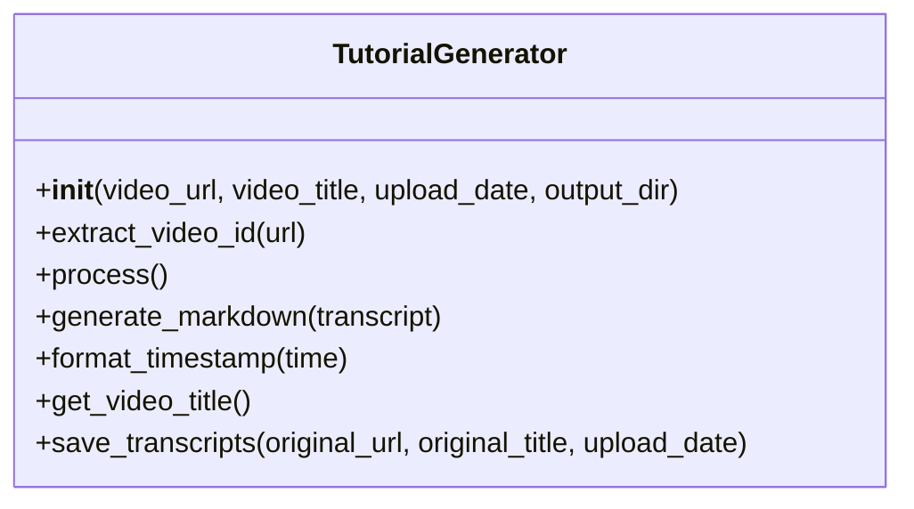
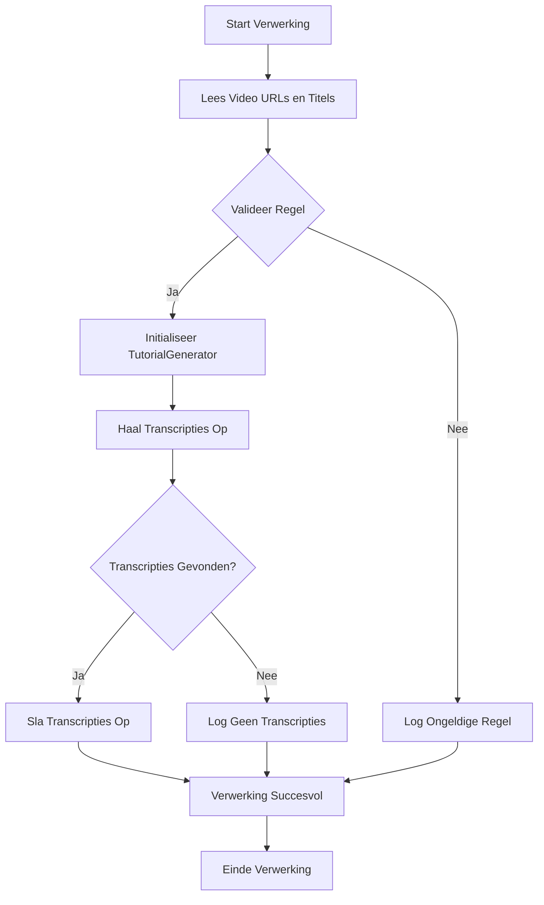

# Tutorial Generator Documentatie

## Overzicht

De `TutorialGenerator` is een Python-klasse die is ontworpen om Markdown-transcripties van YouTube-video's te genereren. Het script haalt transcripties op in meerdere talen en voegt tijdstempels toe die linken naar specifieke punten in de video, wat navigatie vergemakkelijkt.

## Class Diagram



## Functionaliteiten

- **Video ID Extractie**: Haalt de video-ID uit verschillende YouTube URL-formaten.
- **Transcriptie Ophalen**: Verzamelt transcripties in opgegeven talen (Nederlands en Engels).
- **Markdown Generatie**: Formatteert transcripties in Markdown-tabellen met klikbare tijdstempels.
- **Foutafhandeling**: Logt fouten tijdens het proces in een foutlogbestand.

## Implementatie

### 1. Initialisatie

De constructor van de `TutorialGenerator` klasse initialiseert de objecteigenschappen en haalt de video-ID uit de opgegeven URL.

```python
def __init__(self, video_url, video_title, upload_date, output_dir):
    self.video_url = video_url
    self.transcripts = {}
    self.output_dir = output_dir
    self.video_id = self.extract_video_id(self.video_url)
    self.languages = ["nl", "en"]
    self.video_title = video_title
    self.upload_date = upload_date
```

### 2. Video ID Extractie

De `extract_video_id` methode haalt de video-ID uit de YouTube URL. Dit is cruciaal voor het ophalen van transcripties.

```python
def extract_video_id(self, url):
    parsed_url = urlparse(url)
    if parsed_url.netloc == 'youtu.be':
        return parsed_url.path[1:]
    elif parsed_url.netloc in ('www.youtube.com', 'youtube.com'):
        query_params = parse_qs(parsed_url.query)
        if 'v' in query_params:
            return query_params['v'][0]
        elif parsed_url.path.startswith('/embed/'):
            return parsed_url.path.split('/')[2]
    return None
```

### 3. Transcriptie Ophalen

De `process` methode haalt transcripties op in de opgegeven talen en slaat ze op in de `transcripts` dictionary.

```python
def process(self):
    if self.video_id:
        transcript_list = YouTubeTranscriptApi.list_transcripts(self.video_id)
        for transcript in transcript_list:
            if transcript.language_code in self.languages:
                self.transcripts[transcript.language_code] = transcript.fetch()
```

### 4. Markdown Generatie

De `generate_markdown` methode genereert een Markdown-string van het transcript en maakt een tabel met tijdstempels.

```python
def generate_markdown(self, transcript):
    output_text = ""
    for segment in transcript:
        timestamp = self.format_timestamp(segment['start'])
        video_link = f"{self.video_url}&t={int(segment['start'])}"
        output_text += f"| {self.upload_date} | <a href='{video_link}'>{timestamp}</a> | {segment['text']} |\n"
    return output_text
```

### 5. Opslaan van Transcripties

De `save_transcripts` methode slaat de transcripties op in Markdown-bestanden in de opgegeven uitvoermap.

```python
def save_transcripts(self, original_url, original_title, upload_date):
    safe_title = f"{upload_date}_" + "".join(c if c.isalnum() else "_" for c in self.get_video_title())
    if not os.path.exists(self.output_dir):
        os.makedirs(self.output_dir, exist_ok=True)
    for lang_code, transcript in self.transcripts.items():
        file_name = f"{safe_title}_transcript_{lang_code}.md"
        file_path = os.path.join(self.output_dir, file_name)
        with open(file_path, "w", encoding="utf-8") as f:
            f.write(f"### [{original_title}]({original_url})\n\n")
            f.write(f"| Datum | URL (Tijdstempel) | Originele Tekst |\n")
            f.write(f"|---|---|---|\n")
            f.write(self.generate_markdown(transcript))
```

## Flowchart van het Proces



## Foutafhandeling

Fouten tijdens de verwerking worden opgeslagen in een logbestand, wat helpt bij het debuggen en verbeteren van de gebruikerservaring.

```python
if error_messages:
    with open(error_log_file, "w", encoding="utf-8") as f:
        f.write("# Error Log\n\n")
        f.write("| URL | Foutmelding |\n")
        f.write("|---|---|\n")
        for error in error_messages:
            f.write(f"| {error['url']} | {error['error']} |\n")
```

## Conclusie

De `TutorialGenerator` klasse biedt een krachtige manier om transcripties van YouTube-video's te genereren en op te slaan in een gestructureerd Markdown-formaat. Het gebruik van Mermaid-diagrammen helpt bij het visualiseren van de architectuur en het proces, wat de documentatie toegankelijker maakt voor ontwikkelaars en gebruikers.
