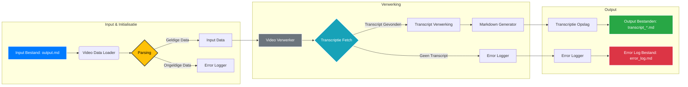
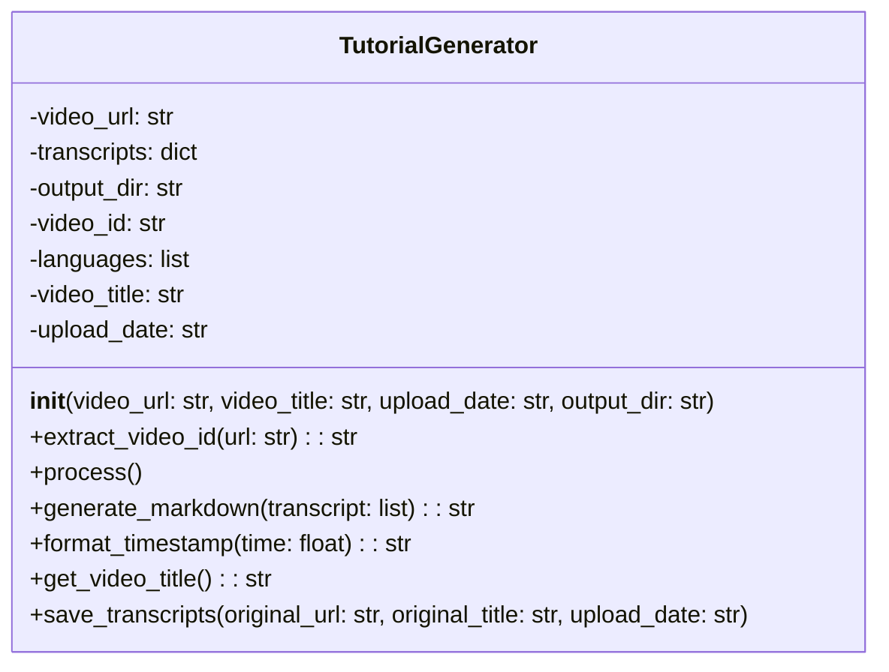

# Gedetailleerde Uitleg van het YouTube Transcript Generator Script

Dit document geeft een gedetailleerde uitleg over het Python-script voor het genereren van YouTube-transcripten. Het script is ontworpen om de transcripties van een lijst met YouTube-video's op te halen, op te slaan en eventuele fouten die tijdens dit proces voorkomen te loggen. Dit document dient als een compleet overzicht van het script, inclusief de architectuur, dataflow, code en parallelle verwerking.

## Doel van het Script

Het hoofddoel van dit script is het automatiseren van het proces waarbij Markdown-bestanden worden gegenereerd die de transcripties van YouTube-video's bevatten. Deze transcripties zijn niet alleen handig voor het archiveren en doorzoeken van video-inhoud, maar ook voor diepgaande analyses en het creëren van een gecentraliseerde kennisbank. In essentie wordt het handmatige werk van het uittypen of kopiëren van ondertitels geëlimineerd, wat resulteert in een efficiëntere workflow.

## Gedetailleerde Technische Doelstellingen

1. **Transcriptie Retrieval:** Het script moet betrouwbaar de transcripties van YouTube-video's kunnen ophalen via de YouTube API. Hierbij moet rekening worden gehouden met mogelijke API-fouten.
2. **Taalondersteuning:** Het script moet specifiek transcripties in het Nederlands (`nl`) en Engels (`en`) kunnen ophalen, en eventuele andere talen negeren.
3. **Klikbare Tijdstempels:** De transcripties moeten voorzien zijn van tijdstempels die direct linken naar het betreffende moment in de video. Deze links moeten correct werken in Markdown, inclusief het doorgeven van het tijdsinterval aan de URL.
4. **Bestandsformaat:** Het gegenereerde bestand moet in Markdown-formaat zijn. Hierbij is er een specifiek format voor de bestandsnaam en de tabellen.
5. **Geavanceerde Foutenafhandeling:** Het script moet fouten op verschillende niveaus kunnen detecteren en loggen, inclusief API-fouten, parsing-fouten en schrijf-fouten. De foutenlog moet ook in Markdown-formaat zijn, met de juiste url en melding.
6. **Parallele Verwerking:** Om de efficiëntie te verhogen, moet het script meerdere video's tegelijk kunnen verwerken.
7. **Correcte Titel:** De bestandsnaam moet beginnen met de datum van upload, gevolgd door een unieke en veilige titel. De bestandsnaam mag geen dubbele underscores hebben.
8. **Input Formaat:** Het script moet de format `Datum,URL,Titel` van het inputbestand kunnen lezen.
9. **Extra Kolom:** Het markdown bestand moet de datum aan de linkerkant hebben.

## Gedetailleerde High-Level Architectuur

De architectuur is verdeeld in drie hoofdcomponenten: Input & Initialisatie, Verwerking, en Output. Dit schema helpt om de dataflow en de verantwoordelijkheid van elk onderdeel beter te begrijpen.



## Gedetailleerde Beschrijving van de Componenten

### Input Bestand (output.md)

Dit is een tekstbestand waarin elke regel de volgende gegevens in CSV-formaat bevat: Datum DD-MM-YYYY, URL, Titel.

Het bestand wordt gebruikt om te bepalen welke video's verwerkt moeten worden en de metadata van die video's.

### Video Data Loader

Deze component leest het `output.md` bestand in, regel voor regel.

Het is verantwoordelijk voor het opslaan van de data naar een line.

### Parsing

De Parsing component kijkt of het format correct is.

Als het format niet correct is, wordt de line doorgestuurd naar de Error Logger.

Als het format correct is, wordt de data doorgestuurd naar de Input Data.

### Input Data

Deze component pakt de data uit de line en stuurt de URL, title en upload-datum door naar de Video Verwerker.

### Video Verwerker

Dit is de kern van het script, die de `TutorialGenerator` class gebruikt om elke video individueel te verwerken.

De Transcriptie Fetch component wordt aangeroepen om de transcripties op te halen.

### Transcriptie Fetch

Deze component is verantwoordelijk voor het ophalen van de transcripties in `nl` en `en`.

Als er geen transcripten zijn, wordt dit naar de Error Logger gestuurd.

Als er transcripten zijn gevonden, worden deze naar de Transcript Verwerking gestuurd.

### Transcript Verwerking

Deze component voegt alle relevante data samen.

De data wordt naar de Markdown Generator gestuurd.

### Markdown Generator

Deze component is verantwoordelijk voor het genereren van de Markdown-geformatteerde tabel die de transcripties en tijdstempels bevat.

Het voegt de datum, de tijdstempels, en de tekst van het transcript samen in een tabel.

### Transcriptie Opslag

Deze component is verantwoordelijk voor het opslaan van de transcriptie naar het juiste transcript.md bestand.

### Error Logger

Deze component logt alle fouten die optreden tijdens het verwerken.

De fouten worden gestructureerd opgeslagen met de juiste URL en de foutmelding. Dit wordt opgeslagen in de `error_log.md`.

### Output Bestanden

- **Transcriptiebestanden**: Deze bestanden bevatten de transcripties van de video's in Markdown-formaat, inclusief klikbare tijdstempels en een extra kolom met de datum.
- **Foutenlogbestand (error_log.md)**: Dit bestand bevat een tabel met alle fouten die optraden tijdens het uitvoeren van het script, inclusief de betrokken video-URL's.

## De TutorialGenerator Class

De `TutorialGenerator` class is de kern van de video-verwerking in ons script. Deze class is verantwoordelijk voor het ophalen van transcripten en het genereren van de uiteindelijke Markdown output.



### Initialisatie (`__init__`)

- `video_url`: De URL van de YouTube-video (string).
- `transcripts`: Een lege dictionary ({}) om de transcripten per taal op te slaan.
- `output_dir`: De map waar de transcripten worden opgeslagen (string).
- `video_id`: De ID van de YouTube-video.
- `languages`: Een lijst met talen waarvoor transcripten worden opgehaald (["nl", "en"]).
- `video_title`: De titel van de YouTube-video (string), rechtstreeks overgenomen uit de input.
- `upload_date`: De uploaddatum van de video (string), rechtstreeks overgenomen uit de input.

```python
def __init__(self, video_url, video_title, upload_date, output_dir):
    self.video_url = video_url
    self.transcripts = {}
    self.output_dir = output_dir
    self.video_id = self.extract_video_id(self.video_url)
    self.languages = ["nl", "en"]
    self.video_title = video_title
    self.upload_date = upload_date
```

### Methodes

#### `extract_video_id(url: str) -> str`

Deze methode extraheert de YouTube-video ID uit de gegeven URL.

Het ondersteunt verschillende YouTube URL-formaten (youtu.be, www.youtube.com, youtube.com, /embed/) en geeft de video ID terug of None.

Deze methode gebruikt de `urllib.parse` library om de URL te ontleden.

```python
def extract_video_id(self, url):
    parsed_url = urlparse(url)
    if parsed_url.netloc == 'youtu.be':
        return parsed_url.path[1:]
    elif parsed_url.netloc in ('www.youtube.com', 'youtube.com'):
        query_params = parse_qs(parsed_url.query)
        if 'v' in query_params:
            return query_params['v'][0]
        elif parsed_url.path.startswith('/embed/'):
            return parsed_url.path.split('/')[2]
    return None
```

#### `process()`

Deze methode haalt transcripties op in de opgegeven talen en slaat ze op in de `transcripts` dictionary.

```python
def process(self):
    if self.video_id:
        transcript_list = YouTubeTranscriptApi.list_transcripts(self.video_id)
        for transcript in transcript_list:
            if transcript.language_code in self.languages:
                self.transcripts[transcript.language_code] = transcript.fetch()
```

#### `generate_markdown(transcript: list) -> str`

Deze methode genereert een Markdown-string van het transcript en maakt een tabel met tijdstempels.

```python
def generate_markdown(self, transcript):
    output_text = ""
    for segment in transcript:
        timestamp = self.format_timestamp(segment['start'])
        video_link = f"{self.video_url}&t={int(segment['start'])}"
        output_text += f"| {self.upload_date} | <a href='{video_link}'>{timestamp}</a> | {segment['text']} |\n"
    return output_text
```

#### `save_transcripts(original_url: str, original_title: str, upload_date: str)`

Deze methode slaat de transcripties op in Markdown-bestanden in de opgegeven uitvoermap.

```python
def save_transcripts(self, original_url, original_title, upload_date):
    safe_title = f"{upload_date}_" + "".join(c if c.isalnum() else "_" for c in self.get_video_title())
    if not os.path.exists(self.output_dir):
        os.makedirs(self.output_dir, exist_ok=True)
    for lang_code, transcript in self.transcripts.items():
        file_name = f"{safe_title}_transcript_{lang_code}.md"
        file_path = os.path.join(self.output_dir, file_name)
        with open(file_path, "w", encoding="utf-8") as f:
            f.write(f"### [{original_title}]({original_url})\n\n")
            f.write(f"| Datum | URL (Tijdstempel) | Originele Tekst |\n")
            f.write(f"|---|---|---|\n")
            f.write(self.generate_markdown(transcript))
```

## Conclusie

Dit document biedt een uitgebreide uitleg van het YouTube Transcript Generator script, inclusief de architectuur, componenten en methodes. Door het gebruik van Mermaid-diagrammen en gedetailleerde codevoorbeelden, is het gemakkelijk om de werking van het script te begrijpen en aanpassingen te maken waar nodig.
